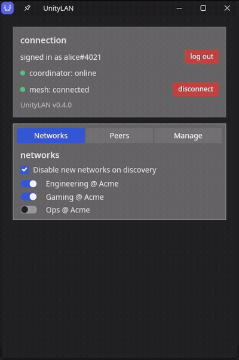

# UnityLAN

**A private mesh VPN whose membership is your Discord roles.**

You already have a group of people organized in Discord — a gaming community, a homelab crew, a
project team. UnityLAN turns those Discord roles into a private, encrypted LAN. Give a role a
network, and everyone who holds that role can reach each other's machines directly, as if they were
plugged into the same switch. Lose the role, lose access — automatically.

No accounts to invite, no keys to hand out, no IPs to remember. If you can manage a Discord server,
you can run the network.

```
alice@laptop  ~ $  ssh nas.bob.mycommunity.unity.internal
bob@nas       ~ $
```

<p align="center">
  
</p>

---

## What it actually is

- **A WireGuard mesh.** Every online member forms a **direct, peer-to-peer** [WireGuard](https://www.wireguard.com/)
  tunnel to every other member they share a network with. Traffic is end-to-end encrypted and goes
  straight between machines — it does **not** flow through any server we or you run.
- **Membership = Discord roles.** An admin registers a Discord role as a *network* with a slash
  command (`/unitylan network add`). Holding the role gets you in; a role change in Discord takes
  effect on the mesh within seconds.
- **A lightweight control plane.** A **coordinator** authenticates people against Discord, hands out
  addresses, and helps peers find each other — then gets out of the way. Use the **hosted canonical
  instance** (just invite its bot to your server) or **self-host** your own (one Docker container).
  Either way it **carries no traffic and holds no one's private keys.**
- **Human-readable names.** Machines get DNS names like
  `laptop.alice.mycommunity.unity.internal` (or just `alice.mycommunity.unity.internal` for a
  member's primary device) instead of raw IPs.

If you know Tailscale: it's the same *shape* (control plane + P2P WireGuard data plane), but the
identity source is **your own Discord server** — no third-party account, no company in the middle.
Use the project's hosted coordinator, or run your own if you'd rather hold the trust anchor.

## Why you might want it

- **You run a game-server community.** Give a role you create — say `@regulars` — a network, and
  everyone who holds it can hit the Minecraft/Valheim/whatever box by name, with no port forwarding
  and no public exposure. Kick someone in Discord and they're off the LAN. (A network is always a
  role you pick; `@everyone` can't be one, so nobody joins just by being in the server.)
- **You have a homelab and a few trusted people.** Share services (NAS, Jellyfin, a git server)
  with exactly the people who hold a role — no VPN accounts to provision or revoke by hand.
- **You want a private LAN for a team** but don't want to stand up an identity provider. You already
  have one: Discord.

## Why you might *not* (yet)

Being upfront so you can decide before installing:

- **Pre-1.0.** UnityLAN works end-to-end (Linux and Windows), but it's young software. Treat it as
  such.
- **NAT traversal is still maturing.** Direct hole-punching works for common (cone) NATs today; a
  ciphertext-only relay fallback for the hardest CGNAT/symmetric-NAT cases is on the roadmap, not
  shipped. Most home connections are fine.
- **macOS/mobile aren't ready.** Linux and Windows are the current first-class targets. The data
  plane is portable userspace WireGuard by design, so macOS and mobile are planned — just not here
  yet.

## How it works (the 60-second version)

1. **A coordinator watches your Discord server** — invite the hosted bot, or self-host your own. It
   holds one Ed25519 signing key: the trust anchor for your whole mesh.
2. **A member installs the client** (a privileged background *engine* + an unprivileged desktop
   *GUI*, à la Tailscale) and logs in with Discord.
3. The coordinator checks their roles and issues a **short-lived, signed attestation** — a token
   that cryptographically binds *this user + this role + this device + this IP + this WireGuard key*.
   It can't be forged, and it expires, so it must be continually re-earned.
4. **Peers verify each other's attestations** against the pinned coordinator key and form direct
   WireGuard tunnels. From here the data plane is pure peer-to-peer.
5. Members discover each other by **long-polling the coordinator** (no gossip flood, no always-on
   connection to babysit). A role change in Discord bumps a version and every client re-syncs at
   once.

The design goal throughout is **decentralization**: the coordinator is a lightweight control plane,
not a relay. Once tunnels are up, the mesh keeps running with the coordinator barely involved, and
any online member can help a new person bootstrap in.

Want the real depth — trust model, NAT strategy, why not fully serverless? See
[`docs/design.md`](docs/design.md) and [`docs/technical.md`](docs/technical.md).

## Security model, briefly

- **The coordinator never sees your traffic** and never holds a peer's private key. WireGuard keys
  are generated on each device and never leave it.
- **One signing key per deployment is the trust anchor.** Clients pin it on first contact (TOFU) and
  verify every peer against it — a compromised or forged key's blast radius is a single guild, never
  across guilds.
- **Attestations are short-lived** and re-issued on a TTL, so revoking a Discord role revokes mesh
  access without waiting for anything to expire on its own schedule.
- **Nothing on your machine is exposed by default.** Joining a network does *not* open your box up.
  The engine installs a host firewall that, on the mesh interface, **drops all inbound** except what
  you explicitly share — a peer can ping you and nothing else. To let peers reach a service you run
  `expose` a specific port, and you can scope it to a single network's members. Your regular LAN and
  localhost traffic is never touched. So a random role-holder can be *on the mesh* without being able
  to open a single connection to your machine.

## Try it / install

Prebuilt packages are attached to each [GitHub Release](../../releases); build instructions and the
full install steps live in [`packaging/README.md`](packaging/README.md).

- **Desktop (Linux):** install the `unitylan-desktop` package — it pulls in the engine, CLI, and
  GUI. `sudo systemctl enable --now unitylan-engine`, then log in from the GUI.
- **Desktop (Windows):** run the `.msi` — it installs the engine + GUI, bundles the WireGuard
  driver, and registers the service. Log in from the Start-menu app.
- **Headless game server:** install the `unitylan` package (engine + CLI, no graphics libs) and
  enroll with a one-time key — no Discord client needed on the box.

## Get a coordinator

**Easiest — use the hosted instance.** A canonical coordinator + bot is up and free to use.
[Invite the bot](https://discord.com/oauth2/authorize?client_id=1525265707821170818) to your Discord
server, then run `/unitylan network add <role>` —
nothing to host. Point clients at `https://coordinator.unitylan.com`. You're trusting that instance to gate
access to your mesh (it still never sees your traffic or your keys); self-host if you'd rather hold
the trust anchor yourself.

**Full control — self-host.** One container. You'll need a Discord app with a bot token (Server
Members Intent on) and a place to run it behind HTTPS. Full walkthrough — Discord setup, config,
`docker run`, TLS, backups — is in
[**Host the coordinator**](packaging/README.md#host-the-coordinator-server).

> A self-hosted coordinator's database holds your deployment's signing key. **Back it up.** If you
> lose it, every enrolled peer's pinned trust anchor breaks and everyone re-enrolls.

Discord app details: [`docs/discord-setup.md`](docs/discord-setup.md).

## Building from source

It's a Rust workspace (four crates). To build and run a full offline mesh with a fake Discord — no
real bot or network needed — see [`CONTRIBUTING.md`](CONTRIBUTING.md).

```sh
cargo build --release
```

## Documentation

| Doc | What's in it |
| --- | --- |
| [`docs/design.md`](docs/design.md) | Concepts, trust model, addressing, NAT strategy, alternatives considered |
| [`docs/technical.md`](docs/technical.md) | Wire protocols, engine internals, platform splits |
| [`docs/discord-setup.md`](docs/discord-setup.md) | Creating the Discord app + bot |
| [`packaging/README.md`](packaging/README.md) | Building packages, hosting the coordinator, releases |
| [`CONTRIBUTING.md`](CONTRIBUTING.md) | Building, running a local mesh, the checks CI enforces |

## License

[MIT](LICENSE).
