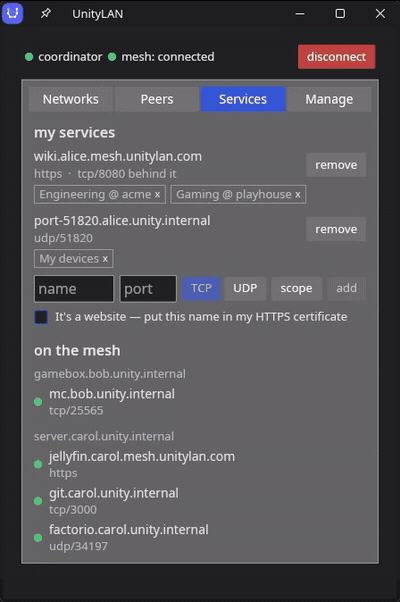
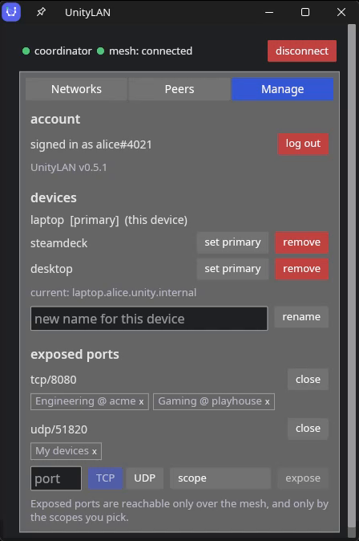

<p align="center">
  
</p>

<p align="center"><strong>Turn your Discord roles into a private, encrypted network.</strong></p>

<p align="center">
  <a href="https://github.com/gtosh4/unity_lan/releases/latest"></a>
  <a href="https://github.com/gtosh4/unity_lan/actions/workflows/ci.yml"></a>
  <a href="https://github.com/gtosh4/unity_lan/actions/workflows/e2e.yml"></a>
  <a href="https://discord.gg/QAmz2j54kS"></a>
  <a href="LICENSE"></a>
  <a href="https://ko-fi.com/gtosh4"></a>
</p>

You already have a group of people organized in Discord — a gaming community, a homelab crew, a
project team. UnityLAN turns those Discord roles into a private, encrypted LAN. Give a role a
network, and everyone who holds that role can reach each other's machines directly, as if they were
plugged into the same switch. Lose the role, lose access — automatically.

No accounts to invite, no keys to hand out, no IPs to remember. If you can manage a Discord server,
you can run the network. It's free — no seats, no plans, no limits — and so is the hosted
coordinator.

```
alice@laptop  ~ $  ssh nas.bob.unity.internal
bob@nas       ~ $
```

<p align="center">
  
</p>

---

## What it actually is

- **A WireGuard mesh.** Every online member forms a [WireGuard](https://www.wireguard.com/)
  tunnel to every other member they share a network with. Traffic goes directly between peers when
  the network path allows it; difficult NAT pairs can use an opted-in member as a ciphertext-only
  relay. There is no exit server, and the coordinator never carries your traffic.
- **Membership = Discord roles.** An admin registers a Discord role as a *network* with a slash
  command (`/unitylan network add`). Holding the role gets you in; a role change in Discord takes
  effect on the mesh within seconds. For **just your own machines** you need none of that — log in
  and they find each other, no server to join or run (see [below](#just-your-own-devices)).
- **A lightweight control plane.** A **coordinator** authenticates people against Discord, hands out
  addresses, and helps peers find each other — then gets out of the way. Use the **hosted canonical
  instance** (just invite its bot to your server) or **self-host** your own (one Docker container).
  Either way it **carries no traffic and holds no one's private keys.**
- **Human-readable names.** Machines get DNS names like
  `laptop.alice.unity.internal` (or just `alice.unity.internal` for a member's primary device)
  instead of raw IPs. What you *serve* gets a name too — `mc.alice.unity.internal` for a game server,
  `jellyfin.alice.unity.internal` for a media library — so nobody has to remember an address and a
  port number. A deployment can also configure a domain it owns, giving every device and service a
  matching public name (`jellyfin.alice.mesh.unitylan.com` on the hosted coordinator) that it can get
  a **real HTTPS certificate** for, served for it, so a browser opening a service on the mesh doesn't
  hit a warning page and the app behind it needs no TLS setup at all. Opt-in per device; see
  [`docs/headless.md`](docs/headless.md#serving-https-without-a-warning-page-optional).

If you know Tailscale: it's the same *shape* (control plane + P2P WireGuard data plane), but the
identity source is **your own Discord server** — no third-party account, no company in the middle.
Use the project's hosted coordinator, or run your own if you'd rather hold the trust anchor.

## Why you might want it

- **You run a game-server community.** Give a role you create — say `@regulars` — a network, and
  everyone who holds it can hit the Minecraft/Valheim/whatever box by name, with no port forwarding
  and no public exposure. Take the role away and they're off the LAN. (A network is always a
  role you pick; `@everyone` can't be one, so nobody joins just by being in the server.)
- **You have a homelab and a few trusted people.** Share services (NAS, Jellyfin, a git server)
  with exactly the people who hold a role — no VPN accounts to provision or revoke by hand.
- **You want a private LAN for a team** but don't want to stand up an identity provider. You already
  have one: Discord.
- **You just want your own machines to reach each other.** Laptop to desktop, phone-tethered to home
  NAS, work box to media server — no server to create, no role to grant, no config file. Log in on
  each device and they mesh. See [Just your own devices](#just-your-own-devices).

## Why you might *not* (yet)

Being upfront so you can decide before installing:

- **Pre-1.0.** UnityLAN works end-to-end (Linux and Windows), but it's young software. Treat it as
  such.
- **NAT traversal is still maturing.** A userspace ICE agent (STUN + UDP hole-punching) forms
  direct tunnels for common NATs, and a ciphertext-only relay fallback carries the hardest
  CGNAT/symmetric-NAT pairs a punch can't connect. A pair can still remain unreachable when no
  suitable relay is online or its network blocks the available UDP transports; the paths are young
  and haven't been hardened across every network shape. Most home connections are fine.
- **Everyone needs a Discord account.** Identity comes from Discord, so every member — and every
  machine you enroll — signs in with one. There's no email-and-password path and no plan for one. If
  that's a dealbreaker for your group, this isn't the tool for you.
- **macOS/mobile aren't ready, and packages are x86-64 only.** Linux and Windows on x86-64 are the
  current first-class targets; there are no ARM packages yet, so a Raspberry Pi means building from
  source. The data plane is portable userspace WireGuard by design, so macOS and mobile are planned
  — just not here yet.

## How it compares

Same family as the other mesh VPNs; the difference is the answer to one question — *who decides
who's on the network?*

| | Who decides who's in | Control plane | Data plane |
| --- | --- | --- | --- |
| **UnityLAN** | A Discord role you already maintain | Open source; self-host or use the hosted one. Carries no traffic either way | WireGuard, direct P2P; hard NAT pairs fall back to an opted-in member as a ciphertext-only relay |
| **Tailscale** | An SSO identity plus an ACL policy file | Vendor-hosted, closed source; self-hosting means Headscale, a third-party reimplementation | WireGuard, direct P2P with vendor-run DERP relays |
| **NetBird** | Your IdP over OIDC, plus policy rules | Open source; self-host or their cloud | WireGuard, direct P2P with a relay fallback |
| **ZeroTier** | Manual approval of each device in a controller | Vendor-hosted controller; self-hostable | Its own layer-2 overlay, not WireGuard |
| **Hamachi / Radmin VPN** | Whoever has the network's password | Vendor-hosted, closed source | Proprietary, leans heavily on vendor relays |

**Where they're ahead.** Tailscale and NetBird are mature products with macOS and mobile clients,
audited code, real ACL tooling, and support behind them. UnityLAN is pre-1.0, Linux and Windows
only, and maintained by one person. If you need something that just works on every device your group
owns, pick one of those.

**Where UnityLAN differs.** Membership comes from a Discord server you already run — no separate
directory to maintain, no third-party account for anyone to create — and self-hosting keeps the
signing key on your own box.

Compared July 2026 from each project's public docs, on architecture rather than pricing or limits,
which change. Something wrong or out of date? Open an issue and we'll fix it. The engineering-level
comparison (NAT strategy, relay design, WG backends) is in [`docs/prior-art.md`](docs/prior-art.md).

## How it works (the 60-second version)

1. **A coordinator watches your Discord server** — invite the hosted bot, or self-host your own. It
   holds an independent Ed25519 signing key for each Discord server it serves, so every server has
   its own trust anchor and compromise of one cannot forge membership in another.
2. **A member installs the client** (a privileged background *engine* + an unprivileged desktop
   *GUI*, à la Tailscale) and logs in with Discord.
3. The coordinator checks their roles and issues a **short-lived, signed attestation** — a token
   that cryptographically binds *this user + this device + this IP + this WireGuard key* to your
   Discord server. Roles aren't baked into the token; the coordinator gates who it hands one to and
   who it shows you. It can't be forged without the coordinator's signing key for that server, and
   it expires, so it must be continually re-earned.
4. **Peers verify each other's attestations** against the pinned key for the Discord server named
   by the attestation and form direct WireGuard tunnels. From here the data plane is pure
   peer-to-peer.
5. Members discover each other by **long-polling the coordinator** (no gossip flood, no always-on
   connection to babysit). A role change in Discord bumps that server's version and every affected
   client re-syncs at once; clients in unrelated servers stay parked.

The design goal throughout is **decentralization**: the coordinator is a lightweight control plane,
not a relay. Once tunnels are up, the mesh keeps running with the coordinator barely involved — peers
even hand each other their short-lived attestations **directly over their tunnels** (the
coordinator's job is minting, not fanning out). So if *your* path to the coordinator breaks while
your peers still have one, your mesh keeps running indefinitely — that's what
[`scripts/gossip-test.sh`](scripts/gossip-test.sh) exercises. The coordinator itself going down is a
different case: nothing new gets minted, so every attestation lapses at its TTL (`attestation_ttl_secs`,
30 min by default) and the engine tears those tunnels down. A mesh rides out a coordinator restart,
not a sustained outage — and first-time enrollment and discovery of previously unknown peers require
the coordinator either way.

Want the real depth — trust model, NAT strategy, why not fully serverless? See
[`docs/design.md`](docs/design.md) and [`docs/technical.md`](docs/technical.md).

## Security model, briefly

- **The coordinator never sees your traffic** and never holds a peer's private key. WireGuard keys
  are generated on each device and never leave it.
- **The coordinator's own per-server signing key is the trust anchor.** It generates one
  independently for each Discord server it serves — UnityLAN's key, not anything Discord issues.
  Clients pin it on first contact (TOFU) and verify every peer against it, so a compromised or
  forged key's blast radius is a single guild, never across guilds. *Why a trusted party exists at
  all:* Discord gives one user no way to check another's roles — only a bot can read a server's
  member list — so membership has to be vouched for by whatever holds the bot token. That's a
  Discord limitation, not a design preference; the botless alternatives are worked through in
  [`docs/design.md` §12](docs/design.md#12-alternatives-considered).
- **Attestations are short-lived** and re-issued on a TTL, so revoking a Discord role revokes mesh
  access promptly — the coordinator drops the member from everyone's snapshot. And because peers only
  keep each other fresh while the coordinator keeps re-issuing, a revoked member is dropped on expiry
  **even if the coordinator is unreachable**; the revocation window is the (configurable) attestation
  TTL.
- **Nothing on your machine is exposed by default.** Joining a network does *not* open your box up.
  The engine installs a host firewall that, on the mesh interface, **drops all inbound** except what
  you explicitly share — a peer can ping you and nothing else. To let peers reach a service you name
  it (or `expose` a bare port), and you can scope it to a single network's members — a peer outside
  that scope isn't even told the name exists. Your regular LAN and
  localhost traffic is never touched. So a random role-holder can be *on the mesh* without being able
  to open a single connection to your machine.

## Try it / install

> **Pre-1.0.** Packages are published and work end to end, but this is young software — Linux and
> Windows, x86-64 only. No ARM builds yet; a Raspberry Pi means [building from
> source](#building-from-source).

Two ways in, depending on which end you're at:

- **You were invited, or it's just your own devices.** Install, log in with Discord, done — someone
  else registered the network, or you don't need one. Nothing to configure either way.
- **You run the Discord server.** [Invite the bot](#get-a-coordinator) and run
  `/unitylan network add <role>`; your members only have to install and log in. You provision nobody.

Prebuilt packages are attached to each [GitHub Release](../../releases); build instructions and the
full install steps live in [`packaging/README.md`](packaging/README.md). Packaged installs already
point at the hosted coordinator, so there's nothing to configure — install, then log in with Discord.

- **Desktop (Linux):** install the `unitylan-desktop` package — it pulls in the engine, CLI, and
  GUI.

  ```sh
  sudo apt install ./unitylan-desktop_*.deb    # or: sudo dnf install ./unitylan-desktop-*.rpm
  sudo systemctl enable --now unitylan-engine
  ```

  Then log in from the GUI.
- **Desktop (Windows):** run the `.msi` — it installs the engine + GUI, bundles the WireGuard
  driver, registers and starts the service, and (via the "Launch UnityLAN now" checkbox on the last
  wizard page) opens the app so you can log in. Re-open it any time from the Start-menu shortcut.
- **Headless game server:** install the `unitylan` package (engine + CLI, no graphics libs) and
  enroll with a one-time key — no Discord client needed on the box.

## Just your own devices

You don't need a Discord server — your own or anyone else's — to use UnityLAN for the machines you
own. Install it, log in with Discord on each device, and they find each other:

1. Install on the first device and log in — the desktop app, or `unitylan-engine login` on a headless
   box. Packaged installs already point at `https://coordinator.unitylan.com`; nothing to configure.
2. Do the same on the second. That's it — no `/unitylan network add`, no role, nothing for an admin
   to grant.

Your devices get the usual names (`laptop.you.unity.internal`, and `you.unity.internal` for whichever
you make primary), reachable from each other and **nobody else** — a stranger who signs in the same
way sees nothing of yours, and you see nothing of theirs. The usual firewall rules still apply: a
peer can ping you and nothing more until you `expose` a port.

This is the **My devices** toggle in the app's Networks tab, on by default. Turning it off opts out
completely — with no role to fall back on, the device holds no mesh address at all.

Join a community later and nothing about your own devices changes: same address, same names, same
tunnels. The community's networks simply appear alongside them, each with its own toggle. (If you go
a month without connecting, a personal address is released and you get a new one next time you log
in. A device enrolled through a community holds its address until it's un-enrolled — `ctl remove` or
`uninstall`.)

## Get a coordinator

**Easiest — use the hosted instance.** A canonical coordinator + bot is up and free to use, run by
this project's maintainer ([gtosh4](https://github.com/gtosh4) on GitHub, `tosh` on Discord).
[Invite the bot](https://discord.com/oauth2/authorize?client_id=1525265707821170818) to your Discord
server, then run `/unitylan network add <role>` —
nothing to host. Point clients at `https://coordinator.unitylan.com`. You're trusting that instance to gate
access to your mesh (it still never sees your traffic or your keys); self-host if you'd rather hold
the trust anchor yourself.

**Full control — self-host.** One container. You'll need a Discord app with a bot token (Server
Members Intent on) and a place to run it behind HTTPS. Full walkthrough — Discord setup, config,
`docker run`, TLS, backups — is in
[**Host the coordinator**](packaging/README.md#host-the-coordinator-server).

> A self-hosted coordinator's database holds your deployment's signing key. **Back it up.** If you
> lose it, every enrolled peer's pinned trust anchor breaks and everyone re-enrolls.

Coordinator setup (Discord app, config, admin dashboard): [`docs/coordinator-setup.md`](docs/coordinator-setup.md).

## Set up a headless device

A game server or other box with no browser enrolls with a **one-time key** — no Discord client on
the box, only HTTP to the coordinator. The short version follows; the full walkthrough, including
how to scope a game or media port, is in [`docs/headless.md`](docs/headless.md).

1. **Mint a key.** From any already-authed device, in a Discord channel where the bot is present, run

   ```
   /unitylan enroll
   ```

   The bot replies (only to you) with a key like `unl_a1b2…`. It is **single-use** and **short-lived
   (~15 min)** — mint it right before you need it, and don't paste it into a shared channel. If it
   expires before the box registers, just run `/unitylan enroll` again for a fresh one.

2. **Install the engine on the box.** Install the `unitylan` package (engine + CLI, no graphics
   libs), then write `/etc/unitylan/engine.toml` — at minimum the coordinator URL and a state dir.
   Use [`engine.example.toml`](engine.example.toml) as a template:

   ```toml
   coordinator = "https://coordinator.unitylan.com"
   state_dir = "/var/lib/unitylan"
   device_name = "gameserver"   # optional; defaults to the system hostname
   ```

3. **Enroll.** Hand the key to the engine one of two ways:

   - **Off disk (recommended):** pass it on the command line — it never gets written to the config.

     ```sh
     sudo unitylan-engine --token unl_a1b2… run
     ```

   - **In the config:** add `enrollment_key = "unl_a1b2…"` to `engine.toml`, then start the service:

     ```sh
     sudo systemctl enable --now unitylan-engine
     ```

   The first register binds the box's WireGuard public key to your Discord user and consumes the key;
   from then on the box is known by its pubkey and the key no longer matters (you can delete it from
   the config). The box joins as `gameserver.<you>.unity.internal`.

4. **Check it's on the mesh, then name what it serves.** The mesh firewall drops all inbound by
   default, so open the service's port — to every peer, to one network's members, or to just your own
   devices — and give it a name people can type:

   ```sh
   sudo unitylan-engine ctl status
   sudo unitylan-engine ctl service add mc 25565 --net minecraft   # mc.<you>.unity.internal
   sudo unitylan-engine ctl service add jellyfin 8096 --web        # + a real HTTPS certificate
   sudo unitylan-engine ctl expose 22 --own-devices                # a bare port, unnamed
   ```

   These find `/etc/unitylan/engine.toml` on their own (an `engine.toml` in the working directory
   wins if there is one, and `-c <path>` overrides both).

   A service is an exposed port with a name, so it inherits the scoping: repeat the command with a
   different network to offer it to several at once, and `ctl service rm <name>` closes every port it
   was on. `--web` additionally puts the name in this device's certificate and serves it over TLS, so
   a browser opens `https://jellyfin.<you>.mesh.unitylan.com` with no warning page and the app behind
   it needs no certificate configuration of its own.

   The desktop app's **Services** tab shows the same thing, plus what everyone else on your mesh is
   running:

   <p align="center">
     
   </p>

## Building from source

It's a Rust workspace (five crates). To build and run a full offline mesh with a fake Discord — no
real bot or network needed — see [`CONTRIBUTING.md`](CONTRIBUTING.md).

```sh
cargo build --release
```

## Documentation

| Doc | What's in it |
| --- | --- |
| [`docs/user-guide.md`](docs/user-guide.md) | The desktop app: logging in, sharing a port, managing devices |
| [`docs/headless.md`](docs/headless.md) | Game servers and media boxes: enrolling with a key, exposing a port, the full CLI |
| [`docs/troubleshooting.md`](docs/troubleshooting.md) | Unreachable peers, names not resolving, the Tailscale address collision |
| [`docs/design.md`](docs/design.md) | Concepts, trust model, addressing, NAT strategy, alternatives considered |
| [`docs/technical.md`](docs/technical.md) | Wire protocols, engine internals, platform splits |
| [`docs/coordinator-setup.md`](docs/coordinator-setup.md) | Standing up a coordinator: Discord app + bot, config, admin dashboard |
| [`packaging/README.md`](packaging/README.md) | Building packages, hosting the coordinator, releases |
| [`CONTRIBUTING.md`](CONTRIBUTING.md) | Building, running a local mesh, the checks CI enforces |

## A note on AI assistance

In the interest of transparency: much of UnityLAN was written with the help of AI coding tools,
with a human in the loop directing the work, reviewing changes, and making the design decisions.

If that gives you pause, that's fair — especially for software that touches your network and
handles cryptographic keys. A few things worth knowing:

- **It's open source.** Every line is here to read, and the security-critical parts (the trust
  model, attestations, key handling) are documented in [`docs/design.md`](docs/design.md) and
  [`docs/technical.md`](docs/technical.md). You don't have to take anyone's word for how it works.
- **It's tested and gated.** CI enforces formatting, linting, and a full test suite on every
  change, and end-to-end network tests exercise the real coordinator↔engine path.
- **It's pre-1.0.** Treat it accordingly — audit before you trust it with anything you can't
  afford to have go wrong, same as you would any young security tool.

The goal is to be upfront rather than quietly ship and hope nobody asks. Bug reports and reviews
are welcome. Found a security issue? Please report it privately — see [SECURITY.md](SECURITY.md).

## Questions and help

The [**UnityLAN Discord**](https://discord.gg/QAmz2j54kS) is where questions get answered — the
maintainer is `tosh` there. Bugs and feature requests are better as
[GitHub issues](../../issues) so they don't get lost in chat. Found a security problem? Report it
privately instead — see [SECURITY.md](SECURITY.md).

## Support the project

UnityLAN is free and open source, built in spare time. If it's useful to you and you'd like to help
keep it going, you can [buy me a coffee](https://ko-fi.com/gtosh4) — every bit is appreciated and
entirely optional.

## License

[GNU Affero General Public License v3.0 or later](LICENSE) (AGPL-3.0-or-later).

Network use is distribution: if you run a modified UnityLAN coordinator (or any part of
this software) as a service, you must offer your users the corresponding source.

UnityLAN is not affiliated with, sponsored by, or endorsed by Discord Inc. "Discord" is a trademark
of Discord Inc.
