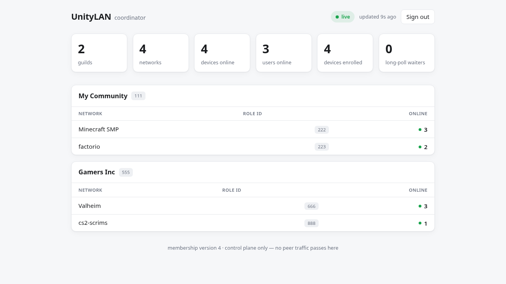

# Coordinator Setup

Everything to stand up a coordinator: the one-time **Discord app** setup (A–G), the
`coordinator.toml` config, the optional **admin dashboard + metrics**, and offline `fake` mode.

The Discord app steps (A–G) on the [Discord Developer Portal](https://discord.com/developers/applications)
are needed only for the **live** coordinator; `fake` mode (bottom) needs none of them.

## A. Create the Discord application
1. **New Application** → name it (e.g. `UnityLAN Test`) → Create.
2. On **General Information**, copy the **Application ID** — this is your OAuth2 **Client ID**.

## B. Bot token + intent
1. Left sidebar → **Bot**.
2. **Reset Token** → copy the **Bot Token** (secret).
3. **Privileged Gateway Intents** → enable **Server Members Intent** (required — reads roles +
   nicknames). **Save**. (Leave *Presence Intent* off.)

## C. OAuth2 client secret + redirect
1. Left sidebar → **OAuth2**.
2. Copy the **Client Secret** (Reset Secret if needed).
3. Under **Redirects**, add exactly `http://localhost:8080/oauth/callback`
   (Discord allows `http` for localhost; must match the coordinator config's bind/port). **Save**.

## D. Invite the bot to a test server
Open (fill in your App ID), pick the guild, Authorize. Include `applications.commands` so the
bot can register the `/unitylan` slash commands:
```
https://discord.com/oauth2/authorize?client_id=YOUR_APP_ID&scope=bot+applications.commands&permissions=0
```
No permission bits needed — reading roles only requires guild membership + the Members Intent.

### Associating networks (in Discord, once the live bot is running)
A coordinator can serve **multiple guilds**. Networks are not automatic — a guild admin
(Manage Guild) designates which roles are networks:
```
/unitylan network add role:@minecraft
/unitylan network remove role:@minecraft
/unitylan network list
```
The network's `<network>` DNS label is the role's own Discord name, and stays in sync when the
role is renamed.

## E. Create test roles + collect IDs
1. Enable **Developer Mode**: User Settings → **Advanced** → Developer Mode **ON**.
2. Server Settings → **Roles** → create e.g. `minecraft`, `factorio`. Assign to your account.
3. Right-click → **Copy ID**:
   - **Guild ID** — the server icon
   - **Role IDs** — each role
   - **Your User ID** — your name

## F. Coordinator config (`coordinator.toml`)

Because the coordinator is multi-tenant and networks are registered via slash commands, the
live config needs only the **bot token**, **OAuth credentials**, and where to **listen**.
Guild IDs and role IDs are **not** config — the bot serves every guild it's invited to, and
networks are registered in Discord with `/unitylan network add`.

> Target schema for **live** mode. Not wired yet — the code currently runs the offline
> `[fake]` source (see below). The `[discord]`/`[oauth]` blocks activate when the live
> Discord + OAuth path is implemented.

```toml
bind = "127.0.0.1:8080"       # 127.0.0.1 for local; a public bind + TLS for real deploys
database = "coordinator.db"

[discord]
bot_token = "..."             # B.2

[oauth]
client_id = "..."             # A.2  (= Application ID)
client_secret = "..."         # C.2
redirect = "http://localhost:8080/oauth/callback"   # MUST match the redirect from C.3
```

| Value | From | Config key |
|---|---|---|
| Bot Token | B.2 | `discord.bot_token` |
| Client ID | A.2 | `oauth.client_id` |
| Client Secret | C.2 | `oauth.client_secret` |
| Redirect URI | C.3 | `oauth.redirect` (must match exactly) |

**Not in config** (discovered or registered, not pasted):
- **Guild ID** — the bot serves every guild it's invited to (D).
- **Role IDs** — registered per guild via `/unitylan network add` (D), stored in SQLite.
- **Your User ID** — only handy for ad-hoc testing.

🔒 Bot token + client secret are secrets. `.gitignore` excludes `coordinator.toml`, `*.key`,
`*.db`. Put secrets straight in the file; don't paste in chat.

For the optional monitoring surface (`[admin]` block → dashboard + Prometheus `/metrics`), see
[Admin dashboard & metrics](#admin-dashboard--metrics-monitoring) below.

## G. Anything else?
- **Create roles** in Discord (E) and **register** them with `/unitylan network add` — that's
  what makes a role a network. Not config.
- **Reachability**: clients *and* Discord's OAuth redirect must reach the coordinator. Local
  testing → `localhost` is fine. Real deploy → a public host/domain with **TLS**; put that
  real callback URL in **both** the Discord **Redirects** list (C.3) and `oauth.redirect`.
- Nothing else Discord-side. Intents (B) + `applications.commands` invite (D) cover it.

---

## Admin dashboard & metrics (monitoring)

For watching a live deployment — how many servers the coordinator serves, networks per server,
and online devices per network — it ships a browser **dashboard** and a Prometheus **metrics**
endpoint. Both are **off until you set an admin token**; with no `[admin]` block they return
`404`, so a coordinator exposes no admin surface until its operator opts in.

```toml
[admin]
token = "…"   # a long random secret YOU generate, e.g. `openssl rand -hex 32`
```

| Route | Auth | What |
|---|---|---|
| `GET /admin` | none (holds no data) | the browser dashboard (a shell that fetches the feed) |
| `GET /admin/stats` | `Authorization: Bearer <token>` | JSON feed the dashboard long-polls |
| `GET /metrics` | `Authorization: Bearer <token>` | Prometheus text exposition |

**Dashboard.** Open `https://<your-coordinator>/admin` in a browser and paste the token once
(kept in the browser's `localStorage`, sent as a bearer header on each request). It updates in
**real time** — the page long-polls the coordinator's membership version, so counts move the
instant a device joins or leaves; otherwise a ~25 s heartbeat keeps it live.



**Auth model.** The token is a secret *you* set — there is no shipped default, so no one
upstream can reach your instance; anyone running their own coordinator controls their own. It
gates only these routes (it is **not** a Discord login and grants no per-guild powers) and the
surface is read-only, **control-plane only — no peer traffic passes through it**.

**Prometheus.** Point a scrape job at `/metrics` with the token as a bearer credential:

```yaml
scrape_configs:
  - job_name: unitylan-coordinator
    scheme: https
    authorization:
      credentials: "<your admin token>"
    static_configs:
      - targets: ["your-coordinator:8080"]
```

Exposed gauges: `unitylan_guilds`, `unitylan_networks`, `unitylan_devices_enrolled`,
`unitylan_devices_online`, `unitylan_users_online`, `unitylan_longpoll_waiters`, and
`unitylan_peers_online{guild_id,guild,network,role_id}` (online devices per network).

> **"Online" vs "enrolled."** Per-network counts are devices **currently connected** (live
> presence). `devices_enrolled` is the deployment-wide total of registered devices — devices
> aren't guild-scoped (one identity across a coordinator's guilds), so there's no per-guild
> enrolled split.

---

## Offline `fake` mode (no Discord needed)
For development and the M1 verify, run the coordinator with a `[fake]` config block that
supplies members/roles directly — no bot token, OAuth, or network. See
`coordinator.example.toml`. Swap to the live `[discord]`/`[oauth]` blocks once the app above
is set up.
