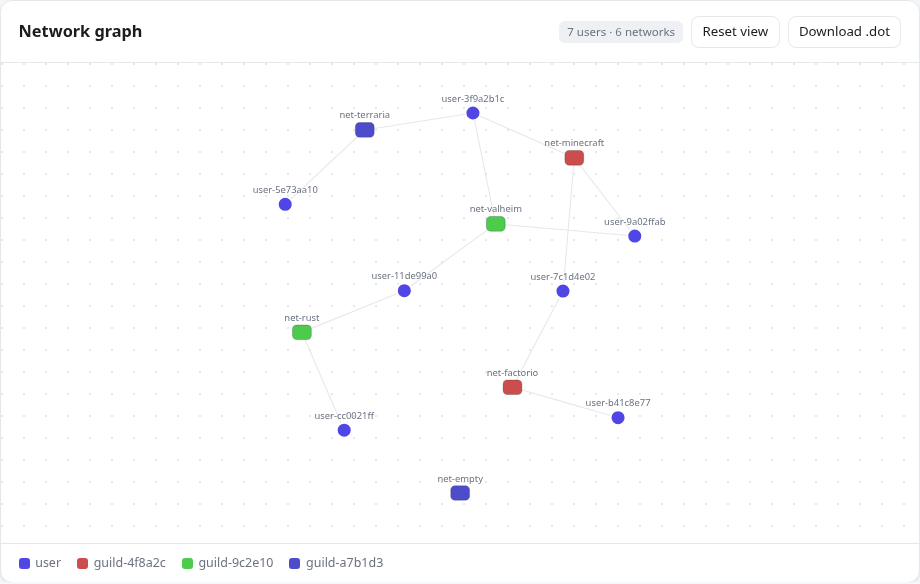

# Coordinator Setup

Everything to stand up a coordinator: the one-time **Discord app** setup (A–G), the
`coordinator.toml` config, the optional **admin dashboard + metrics**, and offline `fake` mode.

The Discord app steps (A–G) on the [Discord Developer Portal](https://discord.com/developers/applications)
are needed only for the **live** coordinator; `fake` mode (bottom) needs none of them.

## A. Create the Discord application
1. **New Application** → name it (e.g. `UnityLAN Test`) → Create.
2. On **General Information**, copy the **Application ID** — this is your OAuth2 **Client ID**.

## B. Bot token + intent
1. Left sidebar → **Bot**.
2. **Reset Token** → copy the **Bot Token** (secret).
3. **Privileged Gateway Intents** → enable **Server Members Intent** (required — reads roles +
   nicknames). **Save**. (Leave *Presence Intent* off.)

## C. OAuth2 public client + loopback redirect
1. Left sidebar → **OAuth2**.
2. Enable the **Public Client** flag. The engine runs OAuth2 **auth-code + PKCE** as a public
   client, so **there is no client secret** — none is generated for or stored on the coordinator.
3. Under **Redirects**, add exactly `http://127.0.0.1:8765/callback` (Discord allows `http` for
   loopback). The **engine** binds this fixed loopback listener itself and does the code exchange,
   so login works from any host/VM even when the browser can't reach the coordinator URL. **Save**.

## D. Invite the bot to a test server
Open (fill in your App ID), pick the guild, Authorize. Include `applications.commands` so the
bot can register the `/unitylan` slash commands:
```
https://discord.com/oauth2/authorize?client_id=YOUR_APP_ID&scope=bot+applications.commands&permissions=0
```
No permission bits needed — reading roles only requires guild membership + the Members Intent.

### Associating networks (in Discord, once the live bot is running)
A coordinator can serve **multiple guilds**. Networks are not automatic — a guild admin
(Manage Guild) designates which roles are networks:
```
/unitylan network add role:@minecraft
/unitylan network remove role:@minecraft
/unitylan network list
```
The network's `<network>` DNS label is the role's own Discord name, and stays in sync when the
role is renamed.

## E. Create test roles + collect IDs
1. Enable **Developer Mode**: User Settings → **Advanced** → Developer Mode **ON**.
2. Server Settings → **Roles** → create e.g. `minecraft`, `factorio`. Assign to your account.
3. Right-click → **Copy ID**:
   - **Guild ID** — the server icon
   - **Role IDs** — each role
   - **Your User ID** — your name

## F. Coordinator config (`coordinator.toml`)

Because the coordinator is multi-tenant and networks are registered via slash commands, the
live config needs only the **bot token**, the **public OAuth client ID**, and where to
**listen**. Guild IDs and role IDs are **not** config — the bot serves every guild it's invited
to, and networks are registered in Discord with `/unitylan network add`.

```toml
bind = "127.0.0.1:8080"       # 127.0.0.1 for local; a public bind + TLS for real deploys
database = "coordinator.db"

[discord]
bot_token = "..."             # B.2

[oauth]
client_id = "..."             # A.2  (= Application ID) — public client_id only; no secret/redirect
```

The engine is a **public PKCE client** — it holds no secret, and it owns the loopback redirect
(`http://127.0.0.1:8765/callback`, C.3) and the token exchange. So the coordinator config carries
**only** the public `client_id`; there is no `client_secret` or `redirect` key.

| Value | From | Config key |
|---|---|---|
| Bot Token | B.2 | `discord.bot_token` |
| Client ID | A.2 | `oauth.client_id` |

**Not in config** (discovered or registered, not pasted):
- **Guild ID** — the bot serves every guild it's invited to (D).
- **Role IDs** — registered per guild via `/unitylan network add` (D), stored in SQLite.
- **Your User ID** — only handy for ad-hoc testing.

🔒 Bot token + client secret are secrets. `.gitignore` excludes `coordinator.toml`, `*.key`,
`*.db`. Put secrets straight in the file; don't paste in chat.

For the optional monitoring surface (`[admin]` block → dashboard + Prometheus `/metrics`), see
[Admin dashboard & metrics](#admin-dashboard--metrics-monitoring) below.

## G. Anything else?
- **Create roles** in Discord (E) and **register** them with `/unitylan network add` — that's
  what makes a role a network. Not config.
- **Reachability**: only **clients** need to reach the coordinator (for `/register` and the token
  hand-off). The OAuth redirect is **loopback to the engine** (`127.0.0.1:8765`, C.3), so Discord
  never redirects to the coordinator — login works even when the browser can't reach it. Local
  testing → `localhost` is fine. Real deploy → a public host/domain with **TLS** for the client API.
- **TLS**: the coordinator serves **plain HTTP** and does not terminate TLS — put a reverse proxy in
  front for a real deployment. See "Behind a reverse proxy" below; two settings there are not
  optional.
- **Open-file limit**: every connected device parks a long-poll, so each one holds an open socket —
  the concurrent-device ceiling is an fd count. The coordinator raises its own soft limit to the hard
  limit at startup (no privilege needed) and logs what it got: `raised the open-file soft limit
  from=1024 to=1048576`. Normally there is nothing to do. Only if the log shows a low *hard* limit
  (or a warning that it couldn't raise) does an operator need to lift it — `LimitNOFILE=` in the
  systemd unit, or `--ulimit nofile=` / `default-ulimits` for a container.
- Nothing else Discord-side. Intents (B) + `applications.commands` invite (D) cover it.

---

## Behind a reverse proxy (TLS termination)

The coordinator speaks plain HTTP, so a real deployment fronts it with Caddy/nginx for TLS. Two
things need attention — both are silent failures, not startup errors.

**1. Tell the coordinator about the proxy.** The rate limiter buckets by source IP. A same-host proxy
makes every request arrive from loopback, so *all* your clients share one bucket and the 30 req/s
per-IP cap throttles the whole deployment at once (measured: 60 requests from 60 distinct clients
through a proxy hop → 30 admitted, 30 got `429`). Fix in `coordinator.toml`:

```toml
trusted_proxies = ["127.0.0.1/32", "::1/128"]
```

With that set, the same test admits all 60. Only list proxies you control — an unlisted peer's
`X-Forwarded-For` is deliberately ignored, since otherwise any caller could forge a fresh bucket per
request and walk past the limiter. Caddy sets the header itself; no Caddyfile change needed for it.

**2. Don't let the proxy cut the long-poll.** Clients park a held request for `attestation_ttl/2`
(15 min by default) — that's what makes idle cost ~zero. A proxy timeout shorter than the hold
breaks the park and puts every client back to polling. Set it explicitly rather than trusting
defaults:

```caddyfile
coordinator.example.com {
	reverse_proxy 127.0.0.1:8080 {
		transport http {
			# Must exceed the long-poll hold (attestation_ttl_secs / 2, default 900s).
			read_timeout 20m
			dial_timeout 5s
		}
	}
}
```

If you shorten `attestation_ttl_secs`, the hold shortens with it and this can come down too — but
keep headroom.

**3. The proxy has its own fd and memory limits.** It holds a connection per device just as the
coordinator does, so its `LimitNOFILE` matters equally (Caddy's packaged systemd unit already sets a
high one). Budget its memory alongside the coordinator's ~48 KB/device when sizing the instance.

---

## Admin dashboard & metrics (monitoring)

For watching a live deployment — how many servers the coordinator serves, networks per server,
and online devices per network — it ships a browser **dashboard** and a Prometheus **metrics**
endpoint. Both are **off until you set an admin token**; with no `[admin]` block they return
`404`, so a coordinator exposes no admin surface until its operator opts in.

```toml
[admin]
token = "…"   # a long random secret YOU generate, e.g. `openssl rand -hex 32`
```

| Route | Auth | What |
|---|---|---|
| `GET /admin` | none (holds no data) | the browser dashboard (a shell that fetches the feed) |
| `GET /admin/stats` | `Authorization: Bearer <token>` | JSON feed the dashboard long-polls |
| `GET /admin/graph` | `Authorization: Bearer <token>` | anonymized network↔user graph the dashboard renders |
| `GET /metrics` | `Authorization: Bearer <token>` | Prometheus text exposition |

**Dashboard.** Open `https://<your-coordinator>/admin` in a browser and paste the token once
(kept in the browser's `localStorage`, sent as a bearer header on each request). It updates in
**real time** — the page long-polls the coordinator's membership version, so counts move the
instant a device joins or leaves; otherwise a ~25 s heartbeat keeps it live.


**Network graph.** Below the stat cards, the dashboard draws a live, **fully anonymized** graph of
your mesh: one node per registered **network** (colored by its guild) and one per **online user**,
with an edge wherever a user is in a network. It's built from the same cheap sources as the stats
feed — the network registry plus in-memory presence — so it adds **no** Discord or database load,
and it refreshes on the same realtime tick as the counts.

- Every label is a deterministic, deployment-keyed hash — **no Discord ID, username, or role name
  ever leaves the coordinator**. The mapping is stable, so the same user stays the same node.
- A user in **multiple guilds** is a single node bridging those guilds' networks (a device is one
  identity across all of a coordinator's guilds), so cross-community overlap is visible at a glance.
- Empty (zero-online) networks still show, as isolated nodes.
- **Scroll to zoom, drag the background to pan, drag a node** to pull the layout around.
- **Download .dot** exports the current graph as [Graphviz](https://graphviz.org/) DOT (networks
  clustered per guild) for offline rendering or archiving.



In the shot above, `user-3f9a2b1c` (top) sits in three different guilds at once — its edges reach a
network of each guild color — while `net-empty` hangs unconnected because no one holding that role
is currently online.

**Auth model.** The token is a secret *you* set — there is no shipped default, so no one
upstream can reach your instance; anyone running their own coordinator controls their own. It
gates only these routes (it is **not** a Discord login and grants no per-guild powers) and the
surface is read-only, **control-plane only — no peer traffic passes through it**.

**Prometheus.** Point a scrape job at `/metrics` with the token as a bearer credential:

```yaml
scrape_configs:
  - job_name: unitylan-coordinator
    scheme: https
    authorization:
      credentials: "<your admin token>"
    static_configs:
      - targets: ["your-coordinator:8080"]
```

Exposed gauges: `unitylan_guilds`, `unitylan_networks`, `unitylan_devices_enrolled`,
`unitylan_devices_online`, `unitylan_users_online`, `unitylan_longpoll_waiters`, and
`unitylan_peers_online{guild_id,guild,network,role_id}` (online devices per network).

> **"Online" vs "enrolled."** Per-network counts are devices **currently connected** (live
> presence). `devices_enrolled` is the deployment-wide total of registered devices — devices
> aren't guild-scoped (one identity across a coordinator's guilds), so there's no per-guild
> enrolled split.

---

## Offline `fake` mode (no Discord needed)
For development and offline tests, run the coordinator with a `[fake]` config block that
supplies members/roles directly — no bot token, OAuth, or network. See
`coordinator.example.toml`. Swap to the live `[discord]`/`[oauth]` blocks once the app above
is set up.
