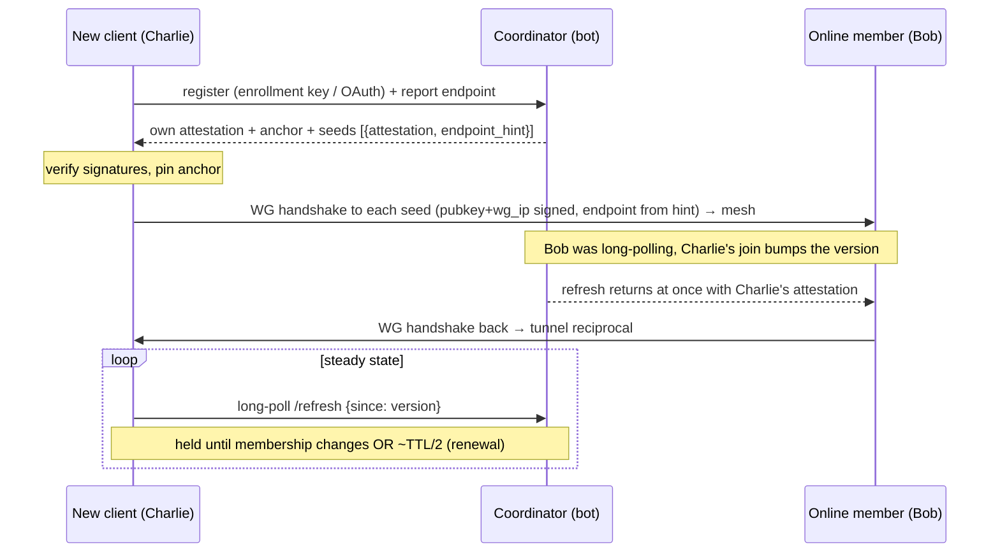
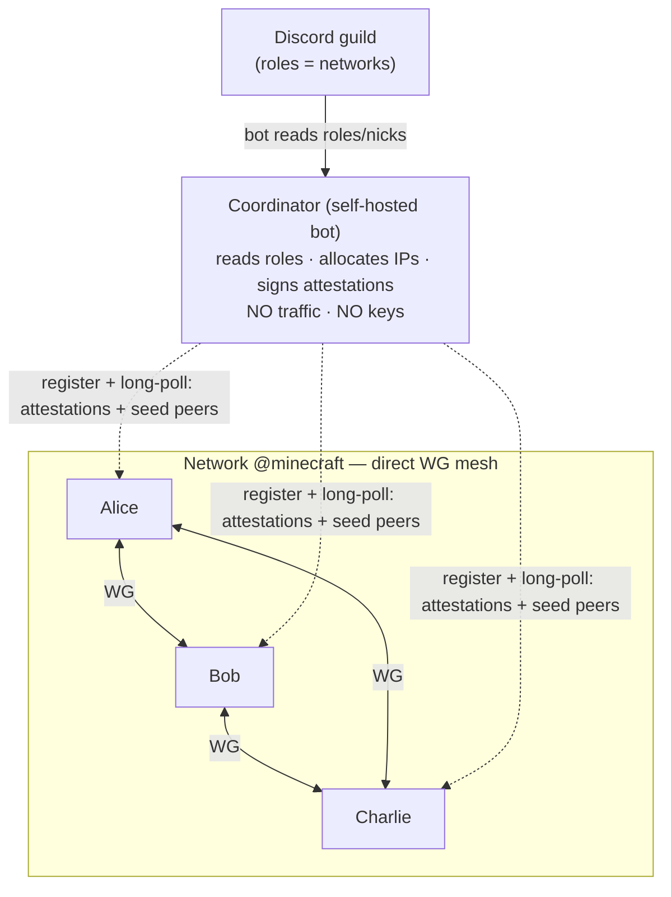

# UnityLAN — Design

A WireGuard mesh VPN whose membership is defined by Discord roles and enforced by a
self-hosted coordinator that issues **short-lived signed attestations**. Peers discover each
other **via the coordinator (long-poll)** and form direct P2P tunnels. Hostnames:
`<device>.<user>.unity.internal` (a user's primary device is just
`<user>.unity.internal`, §6.2).

> Status: **draft**. Decisions marked ✅ are settled; ❓ are open. See
> [Open Questions](#open-questions).

## 1. Concepts

| Term | Meaning |
|---|---|
| **Coordinator** | A self-hosted bot that serves **one or more** guilds (multi-tenant). |
| **Guild / Community** | A Discord server served by a coordinator. Its DNS label is an admin-chosen **community slug**. |
| **User** | A Discord identity (global `@handle`) = the **owner** of devices. |
| **Device** | A WireGuard keypair = one machine. A user owns 1..N devices; one is **primary**. |
| **Network** | A Discord **role** an admin **registered** as a network. An **ACL group** (who may peer), *not* a subnet. Not every role is a network. |
| **Attestation** | A short-lived coordinator-signed token proving `user + role + device_name + ip + wg_pubkey (+ is_primary)`. The unit of membership. |
| **Mesh** | Direct WireGuard tunnels between all online devices that share ≥1 network. |

Networks may **overlap** (a device in several roles). Since the data plane is P2P, a device
has **one IP** and forms **one tunnel** per co-device regardless of how many networks they
share (§6). A single coordinator can serve many guilds.

Admins register networks in Discord via slash commands
(`/unitylan network add|remove|list`); the coordinator persists them in SQLite. Users manage
their own devices (name, primary, remove) from the client app / CLI (§8).

## 2. Goals & Non-Goals

**Goals**
- Membership = **Discord roles**, cryptographically **enforced** (a peer can't fake it).
- **No single user is a point of failure** — any online member can bootstrap a new joiner;
  the coordinator is out of the hot path.
- Multiple, possibly overlapping, isolated networks per guild.
- Direct peer-to-peer encrypted data plane (WireGuard). Coordinator carries **no traffic
  and no private keys** (Tailscale-style: control plane only).
- Self-hostable; one instance serves 1..N guilds → decentralized across operators.
- Human DNS: `gameserver.alice.unity.internal` (primary device: bare `alice.unity.internal`).
- Local control: toggle networks you're entitled to, expose local ports to a network.

**Non-Goals (v1)**
- Fully serverless / botless. Enforcing *someone else's* Discord role requires reading the
  guild members API — only a bot can. So a coordinator is required. (Why botless fails:
  [§12](#12-alternatives-considered).)
- Web dashboard. The client is a **native desktop app** (iced) + a background engine.

  *(A data-plane relay for symmetric-NAT/CGNAT pairs was the original v1 non-goal — v1 shipped
  best-effort diagnostics first; a ciphertext-only peer relay is now **planned**, §7.2.)*

**Platforms**: Windows, Linux, macOS — **and mobile (iOS/Android) as the end-state**, all served
by a single **userspace** WireGuard data plane, the only backend that exists on macOS/iOS/Android
(no kernel WG there). Native kernel drivers (Linux netlink · Windows WireGuardNT) are an
**optional per-OS throughput boost**, not required. See §7.3.

## 3. Components

### 3.1 Coordinator (multi-tenant bot) ✅
Self-hosted binary serving **1..N guilds**. **Not in the traffic path; not in the hot path
for established meshes.** Holds **one Ed25519 signing keypair per guild** = that guild's trust
anchor (persisted in SQLite alongside the network registry + allocations). Each key is
**independently generated** on first use for its guild — **not** derived from a shared master seed,
so there is no single secret whose loss crosses guilds. **Per-guild keys give cryptographic tenant
isolation** — a forged/compromised key's blast radius is one guild, and the coordinator can never
cross-sign guild A's member into guild B (§9). **At rest** the key file is
operator-owned, `0600`, never logged or backed up; end-state is **encrypted at rest** (§9).
Responsibilities:
- Let guild admins **register networks** (`/unitylan network add|remove|list`, Manage-Guild gated).
- Authenticate a client to a Discord identity (OAuth).
- Read the user's **roles** and **nick** via the bot token (guild members).
- **Allocate** each member a stable IP within each role's subnet (§6).
- **Sign attestations** (§4) for the roles the user holds; **re-sign** periodically (TTL).
- **Attest a per-member identity key** (Ed25519) that members use to sign their own endpoint
  records + ICE candidates (§4.2) — WG's X25519 key can't sign.
- Keep a **soft endpoint cache** (`pubkey → ip:port`, self-reported on refresh) to build
  bootstrap **seed lists**, never the real-time source of truth — established-tunnel endpoint churn
  goes **peer-to-peer** (§4.2). It also brokers **ICE candidate exchange over the long-poll** (the
  signal channel — no separate signal server) and pairs a **relay** peer with a stuck client (§7.2)
  — always as a broker, **never on the traffic path**, and only for a pair with **no** working path
  yet; peers that already share a tunnel re-negotiate through it or a third peer, not the coordinator.
  *(Today it observes the reflexive from a co-member's view; end-state, the client's own userspace
  ICE agent gathers candidates via STUN, §7.2/§7.3.)*
- Optionally publish signed **revocation tombstones** for immediate kicks.

### 3.2 Client = engine + GUI ✅
The client is **two processes**, the Tailscale/WireGuard-GUI split (the data plane needs
privilege — TUN device, routes, host firewall, DNS hookup — even with userspace WG; a GUI
should not run as root):

**Engine** — privileged background daemon (systemd · Windows Service · launchd). Owns all
mesh state and the coordinator session. One device = one engine:
- **Enroll** the device under a user (§3.3), then fetch attestations + trust anchor + seeds.
- Generate the WireGuard keypair (**private key never leaves the machine**).
- Configure WireGuard: **one interface**, one peer per online co-device (§6).
- **NAT**: open a reachable port (UPnP); run a userspace **ICE** agent (STUN candidates +
  hole-punch) for NAT'd peers, with a **ciphertext-only relay** fallback when punch can't (§7.2).
  *Today:* UPnP + coordinator-mediated cone punch; ICE + relay are the next increments.
- Local DNS resolver for `*.unity.internal`.
- Exposes a local control socket (UDS / Windows named pipe).

**Front-ends** — both drive the engine over the control socket:
- **GUI** — unprivileged **iced** desktop app + tray, for non-technical users. Login, device
  name/primary, join networks, expose ports, status. Mesh keeps running when the window closes.
- **CLI** — same operations, for **headless dedicated game-server hosts** (no desktop). E.g.
  `unitylan enroll --name gameserver`, `unitylan expose 25565 --net minecraft`, `unitylan status`.

### 3.3 Device enrollment ✅
A device proves it belongs to a user in one of two ways (Tailscale-style):
- **Interactive** (has a browser/Discord): OAuth `identify` → session → register the device's
  pubkey.
- **Headless** (game-server box): the user, on an already-authed device, mints a one-time
  **enrollment key** (`unitylan enroll-key`); the box registers with it → coordinator binds
  its pubkey to the user. **No Discord client needed on the box** — only HTTP to the coordinator.
  A stolen key lets an attacker bind **their** pubkey as a device of the victim's user (all that
  user's networks), so it is a **bearer secret**: ≥128-bit random, **short expiry** (minutes,
  default), **single-use** (race-free consume — first pubkey to redeem wins; later redemptions
  rejected), shown **once**. The operator carries it to the box **out-of-band**; pasting it through
  Discord/chat is the main practical exposure — warn in the UI.

Device management (list / rename / set-primary / remove) is **owner-scoped**: any authed
device of the user can manage the user's whole device set — the lost/old device isn't needed.

## 4. Trust & Attestation Model ✅

The core of enforcement. The coordinator is the only party that can read Discord roles, so
it is the **authority**, but it signs claims that peers verify **offline** — keeping it out
of the hot path.

### 4.1 Attestation (bot-signed, stable)
```
Attestation  (Ed25519-signed by the guild coordinator)
  guild_id
  role_id        # = the network
  user_id
  nick           # guild nickname, sanitized (DNS label)
  wg_ip          # coordinator-allocated, stable
  wg_pubkey      # binds identity → key
  issued_at
  expires_at     # TTL = 30 min (default)
```
- **Trust anchor**: the guild's Ed25519 public key, pinned by the client on first OAuth
  (delivered over TLS). **Verification rule (MUST):** accept an attestation iff it is **signed by
  the pinned guild key**, its **`guild_id` == the pinned guild**, **and** it is **unexpired**. The
  `guild_id` check is load-bearing even with per-guild keys (§3.1) — defence in depth against a
  cross-tenant signing bug.
- The signed fields are **stable** (identity ↔ pubkey ↔ ip). The coordinator need not know
  a member's live endpoint.

### 4.2 Live endpoint (self-reported)
An **endpoint record** `{wg_pubkey, ip:port, seq}` is **signed by the member's coordinator-attested
identity key** (§3.1); newest verified `seq` wins, and a peer rejects a record whose signature or
identity-key attestation doesn't verify. Correctness never needed the signature — WireGuard
authenticates by pubkey (from the signed attestation), so a forged endpoint fails the handshake and
self-corrects — but signing closes the **targeted-DoS / seq-suppression** surface: a third party can
no longer publish bogus high-`seq` records for *another* member's pubkey to burn its peers'
handshakes or shadow its real endpoint. The **same identity key signs ICE candidates** (§7.2).
Endpoints refresh as members roam.
**Distribution splits on whether a tunnel already exists** — keep the coordinator on the cold path
only:
- **Cold pair (no tunnel yet)** — the coordinator's soft endpoint cache seeds it (self-reported on
  refresh, §3.1). This is the out-of-band bootstrap channel; the reciprocity wall (§5) means a
  *first* endpoint can't be peer-carried.
- **Established pair (live tunnel)** — a roamer's endpoint change propagates **peer-to-peer over the
  existing tunnels**, off the coordinator. WireGuard's native endpoint-tracking already self-heals
  the common "one side moved, the other still reachable" case for free; an explicit in-mesh
  announcement covers a two-sided move. *(In-mesh propagation is planned; today all endpoints ride
  the coordinator refresh — see §5.)*

✅ **Endpoint/candidate integrity (planned):** records **and** ICE candidates are signed by a
coordinator-attested per-member Ed25519 identity key (§3.1), so spoofing another pubkey's endpoint
is rejected on verification; rate-limiting stays as a cheap belt-and-braces layer against volume.

### 4.3 Enforcement = control of the WG peer-set ✅
"Enforce role membership" concretely means: **only current role-holders' pubkeys appear in
a network's peer-set.** WireGuard crypto does the actual blocking — no valid attestation for
your pubkey ⇒ no member adds you ⇒ no tunnel. A client adds a peer only if it holds a valid,
unexpired attestation for that peer in a shared network.

### 4.4 Revocation ✅
- **Prompt: coordinator snapshot.** Lose the role → the coordinator drops you from every
  co-member's snapshot → their next `/refresh` (woken at once by the version bump) omits you
  (delta `removed`, §5) → peers prune the pubkey within a poll cycle. This is the fast path while
  the coordinator is reachable.
- **Fail-safe: TTL expiry, client-enforced.** Attestations are short-lived (`attestation_ttl_secs`,
  default 30 min). A peer whose attestation lapses **and can't be refreshed** — the owner lost the
  role so the coordinator stops re-signing, and (with gossip, §5) it can no longer serve a fresh one
  peer-direct — is **dropped by every co-member on expiry**. Because peers keep credentials fresh
  from each other (§5, `docs/gossip-refresh.md`), this bound holds **even if the coordinator is
  unreachable**: revocation propagates through the mesh via expiry, not only via coordinator
  snapshots. Shorter `attestation_ttl_secs` = tighter revocation.
- **Optional: signed tombstone (unbuilt).** For sub-TTL immediate kicks the coordinator could
  publish a signed `{user_id, role_id, revoked_at}` tombstone, retained in snapshots until the
  revoked attestation would have expired. Not implemented — the snapshot-omission path above covers
  the common case; a tombstone would only shave the window below one poll cycle.

## 5. Discovery — Coordinator-mediated long-poll ✅

Discovery is **coordinator-mediated**, not gossip. The coordinator already holds every
member's session and is the only party that can read Discord roles, so it is the natural
propagation point — but it stays out of the *traffic* path: it only ships **signed
attestations**, which peers verify **offline** against the pinned anchor.



- **Seed record** = `{attestation (signed), endpoint_hint}`. The `attestation` gives the
  seed's `wg_pubkey`+`wg_ip` (verifiable, trusted); `endpoint_hint` is the coordinator's soft
  cache (possibly stale). Enough to bring up a tunnel.
- **Long-poll + version (ETag)**: each client holds a `/refresh` carrying its last-seen
  **version**. The coordinator returns **immediately** when relevant membership changed (a
  monotonic version bumps on any presence change) or after a **hold ≈ TTL/2** otherwise. So a
  membership change **wakes parked peers** (near-instant propagation), while idle steady-state
  moves **~zero bytes**. No lost wakeups (`tokio::watch`); a stale `since` returns immediately.
- **Delta sync (`held` / `rev`)**: the client echoes the peers it holds as `(pubkey, rev)` — `rev`
  is an opaque per-seed revision the coordinator minted (it hashes the peer's peering-relevant
  content, **not** attestation freshness). The coordinator returns only **new/changed** seeds plus a
  `removed` list, instead of the full set. So a single join sends each woken client just the joiner
  (O(changes)), not the whole roster — collapsing a membership herd from O(N) per client to
  O(changes), and a login-storm from O(N³) to O(N²). Empty `held` (first contact, or a client
  forcing an attestation refresh) still gets a full snapshot. Additive: `PROTOCOL_VERSION` = 3.
- **Scoped versions**: a client's `version` covers only the scopes it participates in — each guild it
  holds a role in, plus its own user scope (own-device peering crosses guilds). A membership change
  bumps just the scopes it touched, so a join in one guild never wakes a disjoint guild's clients.
  This matters most for the expected deployment shape — one coordinator hosting many small,
  mutually-disjoint communities — where a deployment-wide counter would make *every* device rebuild
  its snapshot on *every* membership event anywhere, almost always to learn nothing.
- **Targeted wakeups**: membership scopes are reserved for changes that concern every
  co-member. **Pair-specific** updates (a peer's reflexive/relay/ICE report is *for* one target) wake
  **only that target** over a per-pubkey channel, not the whole herd — so NAT-traversal exchanges
  (the frequent, bursty case) never fan out. ICE becomes a targeted ping-pong.
- **Sign-cache**: an attestation binds only peer identity + guild, never the caller, so its signed
  blob is identical in every snapshot that includes the peer. The coordinator signs each once per
  reuse window and fans it out — **O(N) Ed25519 signs per epoch, not O(N²)**. A herd wake concatenates
  cached blobs rather than re-signing.
- **Herd jitter**: a version bump releases every parked client at once; each rebuild is staggered by
  a small deterministic per-client offset so the fan-in flattens instead of spiking (burst-credit
  protection on a fan-in chokepoint).
- **Renewal piggybacks the hold**: the hold-timeout return re-issues fresh (re-signed)
  attestations before they expire, so peers' cached seeds never age past TTL.
- **Why not gossip / P2P**: the WireGuard **reciprocity wall** — a new device's first packet
  to an established member is dropped (unknown pubkey), so an existing member must learn the
  newcomer's pubkey **out-of-band** before any tunnel exists. The coordinator, already holding
  everyone's long-poll, is that out-of-band channel. Attestations are signed + verified
  offline, so **trust** never needs the coordinator — only **transport** does.
- **Peer-direct attestation refresh (gossip, ✅)**: keeping known peers' attestations *fresh* is
  moved off the coordinator entirely (`docs/gossip-refresh.md`). Each device pulls only its **own**
  coordinator-minted attestation (O(1)) and **serves it** to co-members over the WG tunnel; a device
  refreshes a known peer by pulling straight from that peer, verifying against the pinned anchor
  exactly as on the coordinator path. **Single-hop authoritative pull, not epidemic gossip** (each
  device is the authority for its own credential) — so it sidesteps the reciprocity wall (it only
  ever talks to already-meshed peers) and the convergence bugs of the earlier gossip attempt. The
  coordinator's O(N²) attestation *fan-out* becomes O(N) mints; the coordinator stays the source of
  truth and the always-present fallback for what the mesh can't do itself (bootstrap, introductions,
  a peer that's unreachable). It also makes revocation **coordinator-independent** (§4.4): a peer
  whose attestation lapses with no source is dropped on expiry even during a coordinator outage.
- **Scale (target: ≤~100 devices/role, a user in a few roles → a few hundred peers/node)**:
  **eager peering** (one WG `[Peer]` per co-device) is comfortable to ~1–2k peers/node in boringtun.
  Coordinator steady cost is now well below O(N) per TTL: signing is **O(N)/epoch** (sign-cache),
  membership deltas are **O(changes)**, NAT exchanges are **targeted** (no herd), and *freshness* is
  carried peer-to-peer. The coordinator is a lean control plane, self-hostable on modest hardware
  (a `t3.micro`-class box handles low thousands of devices).
- **Remaining escape hatch (past ~1k devices in one network)**: **lazy / on-demand peering** — know
  all pubkeys, bring up tunnels only for pairs actually talking, to cap active tunnels below O(N²).
  The full-mesh **data plane** (O(N²) tunnels, rekey/keepalive storm), not the coordinator, is what
  bounds a single flat network, and it only bites in the thousands-per-network.
- **Coordinator resilience**: a brief outage doesn't break an established mesh — peers keep their
  peer-set **and** keep credentials fresh from each other (peer-direct refresh), so an established
  mesh survives an outage **longer than one TTL**. Only new joins/introductions always need the
  coordinator (it's the membership authority). `attestation_ttl_secs` (default 30 min) bounds
  outage-tolerance vs. revocation latency — shorter is tighter revocation.

## 6. Device model, Addressing & DNS ✅ (Model B)

**Identity is device-centric** (the Tailscale model). A Discord **user** owns 1..N
**devices**; a device = a WireGuard keypair. Discord identity is the *auth + grouping*; the
device is the *network node*. **Networks (roles) are ACL groups, not subnets** — since the
data plane is peer-to-peer, two devices form **one** tunnel if they share **≥1** network;
which/how many networks they share only decides *whether* they peer (access) and *what names*
point at them (context).

### 6.1 IP space — one IP per device
- Reserved range **`100.64.0.0/10`** (RFC 6598 / CGNAT). **IPv4-only for now** (games/apps
  need it); dual-stack IPv6 ULA (pubkey-derived) is an additive future option.
- **Per-deployment mesh CIDR**: each coordinator allocates from its own block inside the `/10`
  — a `/16` derived from its trust anchor by default (`netid::default_cidr`), or an explicit
  `cidr` in coordinator config (validated to private/CGNAT space). Disjoint blocks let a future
  multi-coordinator client avoid IP collisions. The CIDR is carried in the **signed attestation**
  (`Attestation::wg_net`), so a client learns it from anchor-verified data and warns at join if it
  overlaps a local interface (can't be spoofed into shadowing the real LAN).
- **One `/32` per device**, allocated in the deployment's CIDR, keyed by the
  device pubkey. Deterministic hint from `hash(pubkey)`, collision-resolved by the
  coordinator. A device has the **same IP in every network** it's in. (An attacker can grind
  pubkeys toward a target IP, but the coordinator arbitrates final assignment — squatting at worst,
  no hijack.)
- **Peering = ACL:** you tunnel with a device iff you share ≥1 network. One WG interface, one
  `[Peer]` per co-device with `AllowedIPs = <device>/32`. Non-shared devices → no peer → no
  route → dropped. A device in two networks reaches members of both; those two groups can't
  reach each other except through a shared member (exactly Tailscale ACL/tag semantics).

### 6.2 Naming
```
alice.unity.internal                 ← single device, or the user's PRIMARY device
gameserver.alice.unity.internal      ← a specific device
laptop.alice.unity.internal          ← another device
```
- **unity** = the **coordinator's** namespace label. While UnityLAN supports a **single
  coordinator** it is fixed (`DNS_SUFFIX`), so the community/guild is **not** in the name. A
  device has one identity and one IP across *all* a coordinator's guilds it belongs to (Model B),
  so a community label would be a redundant tag on one machine. The community rides on each
  **shared network** instead (`api::SharedNetwork`, surfaced in the GUI grouped by server), where
  it's real signal — which server a shared role came from.
  - *Multi-coordinator (future):* when a client can join guilds on **different** coordinators, the
    `unity` label becomes **per-coordinator** (derived from the coordinator's domain, e.g.
    `unitylan.com` → `unity`). That per-coordinator label is what then disambiguates the same
    `@handle` and resolves IP-range collisions across coordinators — the role the community label
    used to play here. Tracked as a `TODO(multi-coordinator)` on `DNS_SUFFIX`.
- **user** = the **global Discord username** (`@handle`, globally unique + readable). Not the
  per-guild nick (nicks aren't unique). Nicks stay as display labels in the GUI only. Because the
  handle is already globally unique, `<device>.<user>` names a machine uniquely with no community
  label.
- **device** = a per-user machine name (unique per user → collision-free; default = OS
  hostname).
- **`<user>.unity.internal`** always resolves to the user's **primary** device, so the common
  single-device case is trivially short. `<device>.<user>.unity.internal` addresses a specific
  device.
- **Search domains** (`unity.internal`, `<user>.unity.internal`) let friends type short names:
  `alice`, or `gameserver.alice`.

### 6.3 Primary device
The `<user>.unity.internal` alias is a *global* name, so **primary is authoritative at the
coordinator** (`primary_device` per `(community, user)`) and propagated in register/refresh
(an `is_primary` flag per device). Default = first enrolled. Owner-updatable from **any** of
their devices (`unitylan primary <device>`) — no need for the old/dead one; on primary
removal the coordinator auto-promotes. Moving networks = an endpoint refresh, not a device
change.

### 6.4 DNS resolution
Local resolver serves `*.unity.internal` from the client's verified attestations (own + co-device
seeds); you only resolve devices you can reach (share a network with). Per-OS hookup:
resolved/resolv.conf (Linux) · NRPT/netsh (Windows) · resolver dir (macOS); hosts-file MVP.
- **Label sanitization:** `nick`/`username` come from Discord (attacker-influenced), so DNS labels
  are sanitized to `[a-z0-9-]`, length-bounded, and **confusable/homograph-folded** — a member
  can't craft a nick that injects a label or visually impersonates another member. Names are
  convenience only; **authorization is always the pubkey in the signed attestation**, never the name.
- **Why `.internal`, not `.local`:** `.local` is RFC 6762 mDNS (OS hijacks to multicast);
  `.internal` is ICANN-reserved (2024) for private use — no public delegation, no clash. All
  UnityLAN names live under a `unity.internal` zone to namespace them within that reserved space.

## 7. Networking

### 7.1 Topology ✅
Full **mesh per network**: every pair of online members of a role forms a direct WG tunnel.
No traffic transits the coordinator.

### 7.2 NAT traversal — connectivity ladder (end-state)
Most-direct-first ladder; the **userspace socket owns traversal** (§7.3), so STUN/ICE machinery
can attach to the data path:
- **Reachable members**: open the WG listen port via **UPnP-IGD** (or manual forward) → directly
  dialable. Covers most home setups.
- **Cone-NAT members**: a userspace **ICE** agent gathers candidates (host + STUN reflexive) and
  hole-punches. Candidates are exchanged over the coordinator **long-poll** — the signal channel,
  so no separate signal server and it stays coordinator-mediated. STUN yields a reflexive even
  with no online peer to observe us, fixing cold-start **bootstrap** (a lone / all-NAT'd mesh).
- **Symmetric / CGNAT / UDP-blocked pairs**: a **relay** peer forwards WG **ciphertext** between
  the pair (e2e intact — the relay holds no keys). Any online member with a public endpoint is a
  candidate relay; the coordinator pairs relay↔client the same way it pairs a punch, staying off
  the traffic path. This is the last rung every magicsock/DERP-class system has. The coordinator
  brokers this only at **true cold start** (zero reachable peers); a client with **any** live tunnel
  selects and reaches a public-endpoint relay **through that existing peer** — no coordinator
  round-trip.

**Relay trust & candidate integrity.** A relay sees only **ciphertext** (e2e intact — no keys) but
does learn **traffic metadata** — which two members talk, volume, timing — and can **selectively
drop/delay** (targeted DoS). So relaying exposes a communication-pattern graph to an arbitrary
co-member: relay eligibility is **opt-in** (prefer a trusted subset), and being relayed is surfaced
in status (§8). **ICE candidates** exchanged over the long-poll are **signed by the sender's
identity key** (§4.2), so a malicious coordinator/MITM can't inject candidates to steer a handshake
onto a relay it controls — injection fails verification; the worst case is denial, not redirection.

**Intermediate states** (roadmap M5):
- *Shipped:* UPnP + endpoint autodiscovery; **peer-observed reflexive** (no STUN server — today
  boringtun owns the WG socket via `defguard_wireguard_rs`, so we read the reflexive from a
  co-member's view instead); coordinator-mediated **cone punch**; reachability diagnostics
  (`Direct` / `Punching` / `Unreachable`).
- *Next (M5.4):* the **ciphertext relay** — backend-agnostic (works on today's kernel+userspace
  split), closes the symmetric/CGNAT tail; current `Unreachable` peers become `Relayed`.
- *Then (M5.5):* replace the ad-hoc peer-observed punch with a real userspace **ICE agent**
  (STUN + ICE + TURN via mature crates), keeping the long-poll as the signal channel.

**Residual (Post-GA):** side-socket ICE still leaves restricted-cone pairs on a proxy/relay hop
rather than a truly-direct path, and UDP-blocked networks need a **:443** relay. Both close with
**in-socket magicsock** — multiplexing STUN/DISCO onto the WG socket itself (needs owning the
socket, §7.3). Deferred; see `docs/prior-art.md` §6.5.

### 7.3 WireGuard backend — userspace-primary (end-state)
The data plane is **userspace-primary**: a userspace WireGuard (boringtun) is the one backend
that exists on **every** target — Linux, Windows, macOS, iOS, Android (macOS/mobile have no kernel
WG) — so it is the canonical path, not a fallback. Owning the UDP socket is also what makes
**in-socket traversal** (§7.2 magicsock) reachable; the end-state drives boringtun's `Tunn` on our
own socket (`Bind`) rather than through a device layer that hides it.
```
trait WgBackend { set_peer, remove_peer, ensure_iface, gen_keypair, ... }
  ├── UserspaceBackend // boringtun — every OS incl. mobile. THE canonical data plane.
  └── NativeBackend    // Linux netlink · Windows WireGuardNT. OPTIONAL per-OS perf boost.
```
Kernel drivers are an **optional throughput optimization**, not required: the workload (gaming
vLANs, gameserver sharing, light file transfer) is latency-bound, not throughput-bound, so the
userspace ceiling is ample — a deployment may drop kernel backends entirely to maintain **one**
data plane (Tailscale's choice). All paths run inside the **privileged engine** (§3.2).

**Intermediate:** today Linux runs userspace (via `defguard_wireguard_rs`) and Windows runs the
wg-nt **kernel** backend; `defguard_wireguard_rs`'s userspace path is unix-only, so a userspace
Windows backend (boringtun + **Wintun** TUN) is a future item — the prerequisite for
magicsock-on-Windows and for collapsing to one data plane. Linux netlink is **deferred** (optional).

## 8. Local Control (GUI + CLI over the control socket)

Both the **iced GUI** (non-tech users) and the **CLI** (headless game-server hosts) drive the
engine via its control socket (no privilege in the front-ends):
- **Enroll / Login** — OAuth (interactive) or enrollment key (headless); pin the coordinator key.
- **Devices** — this device's name, set/see **primary**, list/remove the user's devices.
- **Networks** — list networks you're entitled to; toggle participation locally (you must
  already hold the role; this does not grant Discord roles).
- **Expose** — expose a local port to a network (e.g. `expose 25565 --net minecraft`).
- **Status** — networks, co-devices, tunnels, resolved names, NAT state (live event stream).

## 9. Security & Trust

- WireGuard **private keys never leave the client**; only pubkeys travel (inside signed
  attestations).
- The coordinator carries **no traffic and no private keys** — compromise leaks membership
  metadata + lets an attacker forge memberships for that guild, but not decrypt traffic.
- Trust anchor = the coordinator's Ed25519 pubkey, **pinned on first login**. **Rotation
  (settled):** each rotation emits a `RotationCert` (`prev → new`) signed by the outgoing key; the
  coordinator serves the ordered chain in every `RegisterResp`. A client whose pin is superseded
  walks the chain, verifying each hop under the key it already trusts, and re-pins to the current
  anchor — no manual step. A gap the chain can't bridge (key lost/compromised, nothing to sign) is
  refused → manual re-pin (MITM protection preserved). Trigger: offline `coordinator rotate-key`
  admin subcommand, then restart. **Scope limit — compromise ≠ loss:** the chain is signed by the
  *outgoing* key, so it recovers **scheduled rotation and key-loss**, not **key compromise** — an
  attacker holding the key can mint a valid `prev → attacker` cert and silently migrate the fleet.
  There is **no in-band revocation of a compromised anchor**; recovery is **out-of-band manual
  re-pin**. To make that detectable, the pinned anchor **fingerprint is surfaced in the GUI/CLI** so
  a user can verify it out-of-band — also the mitigation for **first-contact TOFU MITM** (TLS
  authenticates the host, not that it is the legitimate coordinator). The fail-closed co-signature
  answer is tailnet-lock (below).
- **Trust-anchor at rest (crown jewel).** A guild's signing key = forge-anything **for that guild**;
  **per-guild keys** (§3.1) bound the blast radius to one guild rather than the whole deployment.
  **Now:** the key file is operator-owned, `0600`, kept out of logs and backups. **End-state:**
  **encrypted at rest**, decrypted on startup from an operator-supplied passphrase / systemd
  credential / KMS — a stolen disk or leaked backup then yields nothing usable (unattended restart
  provisions the secret via `LoadCredential`/KMS). HSM/KMS-backed **non-exportable** signing is an
  optional deployment mode.
- **Client secrets at rest.** The WG private key (never leaves the device), the OAuth
  session/refresh token, and the pinned anchor are stored under OS-appropriate protection — a
  keystore where available, else `0600` operator-owned files.
- **Coordinator abuse controls.** Beyond the legitimate herd (§5), the register/enroll/refresh API
  is **auth-gated and per-identity rate-limited** to bound registration floods, enrollment
  brute-force, `/10` IP-space exhaustion, and long-poll slot exhaustion.
- **Data minimization.** A compromise or subpoena yields only what the coordinator retains — the
  membership graph + allocations, a **short-TTL** soft endpoint cache, and the presence table. **No
  traffic, no private keys.** Retention windows are kept tight so the leak-on-compromise set stays
  small.
- **Trust-root hardening (future, optional):** the single pinned anchor is one forge point — a
  compromised coordinator could sign an attestation for any pubkey and inject a rogue peer. A
  **tailnet-lock-style co-signature** (a *new* device's attestation additionally signed by a
  trusted admin/peer key) would fail-closed against coordinator compromise. Deferred (post-GA);
  see `docs/prior-art.md` §7.
- Access control = Discord roles, enforced via the peer-set (§4.3). Revocation via TTL /
  tombstone (§4.4).
- Attestation replay bounded by TTL. **Re-key handling (settled):** a device that rotates its WG
  key registers under the new pubkey and passes its old device token as `supersede`; the
  coordinator authenticates ownership by the token and retires the old pubkey at once (removes its
  device row, evicts its presence). A presence reaper (`PRESENCE_TTL_SECS`) is the backstop — it
  also clears any device that vanished without a clean drop (crash / network loss). **Replay within
  TTL is bounded by construction:** an attestation is **pubkey-bound**, so a third party replaying a
  captured one gains nothing without the matching WG **private** key (which never leaves the device);
  the only residual is a device that *legitimately held* the role keeping access until TTL (the
  revocation window above) plus membership-metadata visibility. ❓ per-session nonces (a member
  re-presenting its *own* attestation) still open.
- Per-network WireGuard preshared key (PSK) as defense-in-depth: **deferred to post-v1**. Beyond
  defence-in-depth it also blunts endpoint-spoof handshake spam and adds a weak post-quantum hedge;
  weigh when prioritizing.

## 10. Components Summary



## 11. Rough Milestones

1. **M1** — Coordinator: Discord OAuth + bot-token role/nick read; **per-guild** Ed25519
   attestation signing; IP allocation; device **enrollment** (interactive OAuth + one-time
   headless **enrollment key**, §3.3). Engine (headless): enroll, fetch + verify an attestation
   (signature + `guild_id` match).
2. **M2** — WG backend (userspace primary via defguard): keygen, iface, add/remove peer;
   ⚠️ verify native paths per-OS. Engine control socket (interprocess).
3. **M3** — Mesh formation: coordinator seeds → reciprocal peer-set → mesh forms; discovery is
   coordinator-mediated **long-poll** (P2P gossip prototyped then deferred — WG reciprocity wall, §5).
   Two-node then N-node.
4. **M4** — iced GUI + tray: login, network toggles, live status over the control socket.
5. **M5** — NAT: UPnP port open; cone-NAT hole-punch coordination; then **ciphertext relay**
   (M5.4) + userspace **ICE** agent (M5.5); in-socket magicsock is Post-GA (§7.2).
6. **M6** — DNS resolver + `*.unity.internal` (per-OS hookup); multi-homing across overlapping networks.
7. **M7** — Revocation (TTL refresh + tombstones, retained to TTL); coordinator **anchor key
   rotation** (signed `prev → new` cert chain + offline `rotate-key` subcommand, §9); per-member
   **identity key** signing endpoint records + ICE candidates; `expose`, status polish.
8. **M8** — Native kernel backends (Windows WireGuardNT shipped; Linux netlink **deferred**) as an
   **optional** per-OS perf boost — userspace is the primary data plane (§7.3).

## 12. Alternatives Considered

- **Botless join-secret (Discord Rich Presence "Ask to Join").** A host advertises a
  session; friends click Join and get a `join_secret`. Zero infra. **Rejected as the
  backbone**: it centers the network on one online *host* (host offline → network dead),
  is host-initiated/manual, and **cannot enforce role membership** (an app can't read a
  peer's roles). May survive only as an optional bootstrap convenience.
- **Presence-broadcast + bot reads all presence.** Clients write pubkey/endpoint into their
  own Rich Presence; a bot with the presence intent aggregates. Works, but keeps the bot in
  the hot path and gains nothing over signed attestations + gossip.
- **Fully botless gossip (shared invite secret).** Decentralized, but membership is only
  "whoever holds the secret" — no role enforcement, no per-user revocation. Fails the
  enforcement requirement.
- **Discord Game SDK networking/lobbies** (built-in NAT traversal/relay) — **deprecated by
  Discord**. Not built upon.

## Open Questions

- ~~**Endpoint-record spoofing** (§4.2): rate-limit only, or add a coordinator-attested
  Ed25519 identity key per member to sign endpoint updates.~~ **Resolved (planned):** a
  coordinator-attested per-member Ed25519 identity key signs endpoint records **and** ICE
  candidates; rate-limiting stays as a cheap extra layer (§4.2, §7.2).
- ~~**Coordinator key rotation** (§9): rotate the Ed25519 anchor without hand re-pinning on
  every client.~~ **Resolved:** signed `prev → new` rotation-cert chain, walked client-side; the
  `rotate-key` subcommand mints hops (§9).
- ~~**Pubkey re-key / device change**: a member regenerating keys invalidates cached
  attestations mid-TTL — need a re-key signal.~~ **Resolved:** `supersede` token on re-key retires
  the old pubkey immediately; a presence reaper (`PRESENCE_TTL_SECS`) backstops any unclean drop
  (§9).
- ~~**Symmetric-NAT both-ends** (§7.2): accept best-effort, or commit to a relay-through-peer
  data path?~~ **Resolved (updated):** v1 shipped best-effort + diagnostics; a ciphertext
  relay-through-peer is now **planned (roadmap M5.4)** as the next NAT increment — no longer
  post-GA (§7.2).
- **Coordinator endpoint discovery**: instead of the client hardcoding/human-configuring the
  coordinator URL, the coordinator could **advertise its endpoint via Discord** so the client
  auto-discovers it from the guild. Candidate spots a bot can publish to at runtime: its
  presence/activity ("Playing coord.example.com"), a maintained pinned message / channel
  topic, or a `/unitylan info` reply. Discovery would run over Discord (via the user's own
  session) *before* the client knows any coordinator — then TOFU-pin the anchor as usual. A
  rogue-guild-admin advertising a bad URL only affects their own guild (expected), and the
  surfaced anchor **fingerprint** (§9) still lets a user catch a bad-URL pin out-of-band. Removes
  onboarding friction; revisit for onboarding UX.

_Decided:_ attestation TTL configurable, default 30 min (§5); PSK deferred to post-v1 (§9); **one WG
interface** spans all a client's networks/guilds (§6.2). Discovery = **coordinator-mediated long-poll
+ version/ETag** (§5), hold ≈ TTL/2, renewal piggybacks the hold; **eager peering** at target scale.
Coordinator scale work **shipped** (§5): sign-cache (O(N) signs), **delta sync**, **targeted
wakeups**, herd jitter, and **peer-direct attestation refresh** (gossip — freshness carried
peer-to-peer, coordinator-independent revocation; `docs/gossip-refresh.md`); only **lazy-peering**
remains as the >~1k-per-network escape hatch (§5). **Per-guild signing keys** with a client-side
`guild_id`-match **MUST** (§3.1, §4.1); coordinator-snapshot omission + client-enforced TTL expiry
for revocation (tombstones unbuilt, §4.4); endpoint records + ICE candidates **signed by a per-member identity key** (§4.2); anchor
**fingerprint surfaced** for OOB verify, key-**compromise** recovery is OOB re-pin (§9); signing
key **`0600` now, encrypted-at-rest end-state** (§9).
