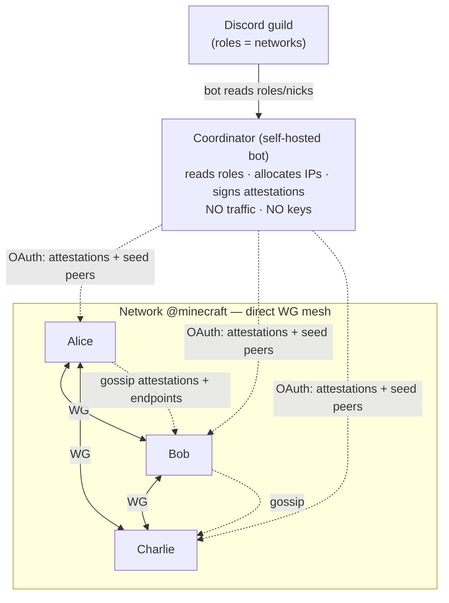

# UnityLAN — Design

A WireGuard mesh VPN whose membership is defined by Discord roles and enforced by a
per-guild coordinator that issues **short-lived signed attestations**. Peers discover each
other **via the coordinator (long-poll)** and form direct P2P tunnels. Hostnames:
`<nick>.<role>.<guild>.internal`.

> Status: **draft**. Decisions marked ✅ are settled; ❓ are open. See
> [Open Questions](#open-questions).

## 1. Concepts

| Term | Meaning |
|---|---|
| **Coordinator** | A self-hosted bot that serves **one or more** guilds (multi-tenant). |
| **Guild / Community** | A Discord server served by a coordinator. Its DNS label is an admin-chosen **community slug**. |
| **User** | A Discord identity (global `@handle`) = the **owner** of devices. |
| **Device** | A WireGuard keypair = one machine. A user owns 1..N devices; one is **primary**. |
| **Network** | A Discord **role** an admin **registered** as a network. An **ACL group** (who may peer), *not* a subnet. Not every role is a network. |
| **Attestation** | A short-lived coordinator-signed token proving `user + role + device_name + ip + wg_pubkey (+ is_primary)`. The unit of membership. |
| **Mesh** | Direct WireGuard tunnels between all online devices that share ≥1 network. |

Networks may **overlap** (a device in several roles). Since the data plane is P2P, a device
has **one IP** and forms **one tunnel** per co-device regardless of how many networks they
share (§6). A single coordinator can serve many guilds.

Admins register networks in Discord via slash commands
(`/unitylan network add|remove|list`); the coordinator persists them in SQLite. Users manage
their own devices (name, primary, remove) from the client app / CLI (§8).

## 2. Goals & Non-Goals

**Goals**
- Membership = **Discord roles**, cryptographically **enforced** (a peer can't fake it).
- **No single user is a point of failure** — any online member can bootstrap a new joiner;
  the coordinator is out of the hot path.
- Multiple, possibly overlapping, isolated networks per guild.
- Direct peer-to-peer encrypted data plane (WireGuard). Coordinator carries **no traffic
  and no private keys** (Tailscale-style: control plane only).
- Self-hostable; one instance serves 1..N guilds → decentralized across operators.
- Human DNS: `alice.minecraft.mycommunity.internal`.
- Local control: toggle networks you're entitled to, expose local ports to a network.

**Non-Goals (v1)**
- Fully serverless / botless. Enforcing *someone else's* Discord role requires reading the
  guild members API — only a bot can. So a coordinator is required. (Why botless fails:
  [§12](#12-alternatives-considered).)
- Data-plane relay for peers where both ends are behind symmetric NAT (best-effort only, see §7.2).
- Web dashboard. The client is a **native desktop app** (iced) + a background engine.

**Platforms**: **Windows-primary**, Linux, macOS-if-convenient. WireGuard uses a
**userspace-portable primary** backend, with native kernel drivers as a per-OS optimization
(Linux netlink · Windows WireGuardNT; macOS is userspace-only). See §7.3.

## 3. Components

### 3.1 Coordinator (multi-tenant bot) ✅
Self-hosted binary serving **1..N guilds**. **Not in the traffic path; not in the hot path
for established meshes.** Holds one **Ed25519 signing keypair** = the trust anchor for every
guild it serves (persisted in SQLite alongside the network registry + allocations).
Responsibilities:
- Let guild admins **register networks** (`/unitylan network add|remove|list`, Manage-Guild gated).
- Authenticate a client to a Discord identity (OAuth).
- Read the user's **roles** and **nick** via the bot token (guild members).
- **Allocate** each member a stable IP within each role's subnet (§6).
- **Sign attestations** (§4) for the roles the user holds; **re-sign** periodically (TTL).
- Keep a **soft endpoint cache** (`pubkey → ip:port`, self-reported on refresh) and act as a
  **STUN reflector** (observe a refresh packet's source, return the reflexive endpoint) — used
  only to build bootstrap **seed lists**, never as the real-time source of truth.
- Optionally publish signed **revocation tombstones** for immediate kicks.

### 3.2 Client = engine + GUI ✅
The client is **two processes**, the Tailscale/WireGuard-GUI split (kernel WG needs
privilege; a GUI should not run as root):

**Engine** — privileged background daemon (systemd · Windows Service · launchd). Owns all
mesh state and the coordinator session. One device = one engine:
- **Enroll** the device under a user (§3.3), then fetch attestations + trust anchor + seeds.
- Generate the WireGuard keypair (**private key never leaves the machine**).
- Configure WireGuard: **one interface**, one peer per online co-device (§6).
- **NAT**: open a reachable port (UPnP); relay hole-punch coordination for NAT'd peers.
- Local DNS resolver for `*.internal`.
- Exposes a local control socket (UDS / Windows named pipe).

**Front-ends** — both drive the engine over the control socket:
- **GUI** — unprivileged **iced** desktop app + tray, for non-technical users. Login, device
  name/primary, join networks, expose ports, status. Mesh keeps running when the window closes.
- **CLI** — same operations, for **headless dedicated game-server hosts** (no desktop). E.g.
  `unitylan enroll --name gameserver`, `unitylan expose 25565 --net minecraft`, `unitylan status`.

### 3.3 Device enrollment ✅
A device proves it belongs to a user in one of two ways (Tailscale-style):
- **Interactive** (has a browser/Discord): OAuth `identify` → session → register the device's
  pubkey.
- **Headless** (game-server box): the user, on an already-authed device, mints a one-time
  **enrollment key** (`unitylan enroll-key`); the box registers with it → coordinator binds
  its pubkey to the user. **No Discord client needed on the box** — only HTTP to the coordinator.

Device management (list / rename / set-primary / remove) is **owner-scoped**: any authed
device of the user can manage the user's whole device set — the lost/old device isn't needed.

## 4. Trust & Attestation Model ✅

The core of enforcement. The coordinator is the only party that can read Discord roles, so
it is the **authority**, but it signs claims that peers verify **offline** — keeping it out
of the hot path.

### 4.1 Attestation (bot-signed, stable)
```
Attestation  (Ed25519-signed by the guild coordinator)
  guild_id
  role_id        # = the network
  user_id
  nick           # guild nickname, sanitized (DNS label)
  wg_ip          # coordinator-allocated, stable
  wg_pubkey      # binds identity → key
  issued_at
  expires_at     # TTL = 30 min (default)
```
- **Trust anchor**: the coordinator's Ed25519 public key, pinned by the client on first
  OAuth (delivered over TLS). A client trusts an attestation iff signed by the guild's key
  and unexpired.
- The signed fields are **stable** (identity ↔ pubkey ↔ ip). The coordinator need not know
  a member's live endpoint.

### 4.2 Live endpoint (gossiped, self-reported)
An **endpoint record** `{wg_pubkey, ip:port, seq}` propagates via gossip, **unsigned**;
newest `seq` wins. No trust needed for correctness: WireGuard authenticates by pubkey (from
the signed attestation), so a forged endpoint simply fails the handshake and self-corrects.
Endpoints refresh as members roam. A member also reports its current endpoint to the
coordinator on refresh (for seeding only). ❓ a peer could spam bogus endpoint records for
*another* pubkey (wasted handshakes) — mitigate with rate-limiting, or sign records with a
coordinator-attested Ed25519 identity key (WG's X25519 key can't sign). Deferred hardening.

### 4.3 Enforcement = control of the WG peer-set ✅
"Enforce role membership" concretely means: **only current role-holders' pubkeys appear in
a network's peer-set.** WireGuard crypto does the actual blocking — no valid attestation for
your pubkey ⇒ no member adds you ⇒ no tunnel. A client adds a peer only if it holds a valid,
unexpired attestation for that peer in a shared network.

### 4.4 Revocation ✅
- **Primary: TTL.** Lose the role → coordinator stops re-signing → the attestation expires
  within the TTL → peers drop the pubkey. Eventual, bounded, simple.
- **Optional: tombstone.** For immediate kicks, the coordinator gossips a signed
  `{user_id, role_id, revoked_at}` tombstone; peers drop the pubkey at once.

## 5. Discovery — Coordinator-mediated long-poll ✅

Discovery is **coordinator-mediated**, not gossip. The coordinator already holds every
member's session and is the only party that can read Discord roles, so it is the natural
propagation point — but it stays out of the *traffic* path: it only ships **signed
attestations**, which peers verify **offline** against the pinned anchor.

```mermaid
sequenceDiagram
    participant C as New client (Charlie)
    participant B as Coordinator (bot)
    participant P as Online member (Bob)
    C->>B: register (enrollment key / OAuth) + report endpoint
    B-->>C: own attestation + anchor + seeds [{attestation, endpoint_hint}]
    Note over C: verify signatures, pin anchor
    C->>P: WG handshake to each seed (pubkey+wg_ip signed; endpoint from hint) → mesh
    Note over P,B: Bob was long-polling; Charlie's join bumps the version
    B-->>P: refresh returns at once with Charlie's attestation
    P->>C: WG handshake back → tunnel reciprocal
    loop steady state
        C->>B: long-poll /refresh {since: version}
        Note over C,B: held until membership changes OR ~TTL/2 (renewal)
    end
```

- **Seed record** = `{attestation (signed), endpoint_hint}`. The `attestation` gives the
  seed's `wg_pubkey`+`wg_ip` (verifiable, trusted); `endpoint_hint` is the coordinator's soft
  cache (possibly stale). Enough to bring up a tunnel.
- **Long-poll + version (ETag)**: each client holds a `/refresh` carrying its last-seen
  **version**. The coordinator returns **immediately** when relevant membership changed (a
  monotonic version bumps on any presence change) or after a **hold ≈ TTL/2** otherwise. So a
  join **wakes every parked peer at once** (near-instant propagation), while idle steady-state
  moves **~zero bytes** (held connections, no periodic re-query). No lost wakeups
  (`tokio::watch`); on reconnect a stale `since` returns immediately.
- **Renewal piggybacks the hold**: the hold-timeout return re-issues fresh (re-signed)
  attestations before they expire, so peers' cached seeds never age past TTL — no extra
  renewal traffic beyond the once-per-hold return.
- **Why not gossip / P2P**: the WireGuard **reciprocity wall** — a new device's first packet
  to an established member is dropped (unknown pubkey), so an existing member must learn the
  newcomer's pubkey **out-of-band** before any tunnel exists. The coordinator, already holding
  everyone's long-poll, is that out-of-band channel. Attestations are signed + verified
  offline, so **trust** never needs the coordinator — only **transport** does.
- **Scale (target: ≤~100 devices/role, a user in a few roles → a few hundred peers/node)**:
  **eager peering** (one WG `[Peer]` per co-device) is comfortable to ~1–2k peers/node in
  boringtun; a few hundred is mid-range. Steady coordinator cost = **O(N) re-signs per TTL**
  (a few signatures/sec even at thousands of devices) + N held connections; idle propagation
  ≈ 0. The coordinator is a control plane, self-hostable on modest hardware.
- **Escape hatch (unbuilt, only past ~1k devices in one network)**: (a) **delta** propagation
  instead of full seed snapshots; (b) **lazy / on-demand peering** — know all pubkeys, bring
  up tunnels only for pairs actually talking, to cap active tunnels below O(N²); (c) P2P
  side-channel introductions or sponsor+gossip fan-out to drop existing-node polling entirely.
  None needed at target scale — the full-mesh data plane (O(N²) tunnels, rekey/keepalive
  storm), not the coordinator, is what bounds a single flat network, and it only bites in the
  thousands-per-network.
- **Coordinator resilience**: a brief outage doesn't break an established mesh (attestations
  valid until TTL; peers keep their peer-set). Only an outage **> TTL** stops refresh; new
  joins always need the coordinator (it's the membership authority). **TTL = 30 min**
  (default): bounds both outage-tolerance and worst-case revocation latency; tombstones give
  immediate kicks.

## 6. Device model, Addressing & DNS ✅ (Model B)

**Identity is device-centric** (the Tailscale model). A Discord **user** owns 1..N
**devices**; a device = a WireGuard keypair. Discord identity is the *auth + grouping*; the
device is the *network node*. **Networks (roles) are ACL groups, not subnets** — since the
data plane is peer-to-peer, two devices form **one** tunnel if they share **≥1** network;
which/how many networks they share only decides *whether* they peer (access) and *what names*
point at them (context).

### 6.1 IP space — one IP per device
- Reserved range **`100.64.0.0/10`** (RFC 6598 / CGNAT). **IPv4-only for now** (games/apps
  need it); dual-stack IPv6 ULA (pubkey-derived) is an additive future option.
- **One `/32` per device**, allocated in the flat `/10` (~4.19M addresses), keyed by the
  device pubkey. Deterministic hint from `hash(pubkey)`, collision-resolved by the
  coordinator. A device has the **same IP in every network** it's in.
- **Peering = ACL:** you tunnel with a device iff you share ≥1 network. One WG interface, one
  `[Peer]` per co-device with `AllowedIPs = <device>/32`. Non-shared devices → no peer → no
  route → dropped. A device in two networks reaches members of both; those two groups can't
  reach each other except through a shared member (exactly Tailscale ACL/tag semantics).

### 6.2 Naming
```
alice.mycommunity.internal                 ← single device, or the user's PRIMARY device
gameserver.alice.mycommunity.internal      ← a specific device
laptop.alice.mycommunity.internal          ← another device
```
- **community** = an **admin-chosen slug** (config, default = sanitized guild name). Discord
  guild *names* aren't unique and *ids* are ugly, so the community picks a slug (like a
  Tailscale tailnet name / a domain). Needed to disambiguate across communities/coordinators.
- **user** = the **global Discord username** (`@handle`, globally unique + readable). Not the
  per-guild nick (nicks aren't unique). Nicks stay as display labels in the GUI only.
- **device** = a per-user machine name (unique per user → collision-free; default = OS
  hostname).
- **`<user>.<community>.internal`** always resolves to the user's **primary** device, so the
  common single-device case is trivially short. `<device>.<user>.<community>.internal`
  addresses a specific device.
- **Search domains** (`<community>.internal`, `<user>.<community>.internal`) let friends type
  short names: `alice`, or `gameserver.alice`.

### 6.3 Primary device
The `<user>.<community>` alias is a *global* name, so **primary is authoritative at the
coordinator** (`primary_device` per `(community, user)`) and propagated in register/refresh
(an `is_primary` flag per device). Default = first enrolled. Owner-updatable from **any** of
their devices (`unitylan primary <device>`) — no need for the old/dead one; on primary
removal the coordinator auto-promotes. Moving networks = an endpoint refresh, not a device
change.

### 6.4 DNS resolution
Local resolver serves `*.internal` from the client's verified attestations (own + co-device
seeds); you only resolve devices you can reach (share a network with). Per-OS hookup:
resolved/resolv.conf (Linux) · NRPT/netsh (Windows) · resolver dir (macOS); hosts-file MVP.
- **Why `.internal`, not `.local`:** `.local` is RFC 6762 mDNS (OS hijacks to multicast);
  `.internal` is ICANN-reserved (2024) for private use — no public delegation, no clash.

## 7. Networking

### 7.1 Topology ✅
Full **mesh per network**: every pair of online members of a role forms a direct WG tunnel.
No traffic transits the coordinator.

### 7.2 NAT traversal ✅ (best-effort tail)
- **Reachable members**: open the WG listen port via **UPnP-IGD** (or manual forward) →
  directly dialable. Covers most home setups.
- **NAT'd members**: the mesh **is the signaling fabric** — a mutually-connected peer relays
  live endpoints + a synchronized punch signal so two NAT'd members can UDP hole-punch. This
  is the back-channel the earlier botless design lacked.
- **Symmetric-NAT on both ends**: hole punch may fail (each end's NAT picks a per-destination
  port, so the peer-observed reflexive is structurally wrong — retrying can't help). **v1 policy
  (settled): best-effort punch + clear `[unreachable: symmetric NAT?]` diagnostic, no relay.**
  The system already degrades cleanly (classifies `Unreachable` after the 30s grace, surfaces it
  in status). Rare for the target audience (home peers — usually ≥1 end is cone/port-forwardable,
  which works); mainly bites strict corporate/CGNAT. Data-plane relay through a common peer is a
  **post-GA** item (see roadmap Post-GA).

### 7.3 WireGuard backend ✅
Trait-based, **userspace-portable primary** with native optimization where available (via
`defguard_wireguard_rs`, which covers both):
```
trait WgBackend { set_peer, remove_peer, ensure_iface, gen_keypair, ... }
  ├── UserspaceBackend // boringtun/wireguard-go — Linux/Windows/macOS. The always-available path.
  └── NativeBackend    // Linux netlink kernel · Windows WireGuardNT. Optimization; needs privilege.
```
Select native where present; else userspace. macOS = userspace only. All paths run inside the
**privileged engine** (§3.2).

## 8. Local Control (GUI + CLI over the control socket)

Both the **iced GUI** (non-tech users) and the **CLI** (headless game-server hosts) drive the
engine via its control socket (no privilege in the front-ends):
- **Enroll / Login** — OAuth (interactive) or enrollment key (headless); pin the coordinator key.
- **Devices** — this device's name, set/see **primary**, list/remove the user's devices.
- **Networks** — list networks you're entitled to; toggle participation locally (you must
  already hold the role; this does not grant Discord roles).
- **Expose** — expose a local port to a network (e.g. `expose 25565 --net minecraft`).
- **Status** — networks, co-devices, tunnels, resolved names, NAT state (live event stream).

## 9. Security & Trust

- WireGuard **private keys never leave the client**; only pubkeys travel (inside signed
  attestations).
- The coordinator carries **no traffic and no private keys** — compromise leaks membership
  metadata + lets an attacker forge memberships for that guild, but not decrypt traffic.
- Trust anchor = the coordinator's Ed25519 pubkey, **pinned on first login**. ❓ key rotation.
- Access control = Discord roles, enforced via the peer-set (§4.3). Revocation via TTL /
  tombstone (§4.4).
- Attestation replay bounded by TTL; ❓ do we need per-session nonces / pubkey-change
  handling on re-key.
- Per-network WireGuard preshared key (PSK) as defense-in-depth: **deferred to post-v1**.

## 10. Components Summary



## 11. Rough Milestones

1. **M1** — Coordinator: Discord OAuth + bot-token role/nick read; Ed25519 attestation
   signing; IP allocation. Engine (headless): fetch + verify an attestation.
2. **M2** — WG backend (userspace primary via defguard): keygen, iface, add/remove peer;
   ⚠️ verify native paths per-OS. Engine control socket (interprocess).
3. **M3** — Gossip: seed → anti-entropy exchange → peer-set → mesh forms. Two-node then N-node.
4. **M4** — iced GUI + tray: login, network toggles, live status over the control socket.
5. **M5** — NAT: UPnP port open; mesh-relayed hole-punch coordination.
6. **M6** — DNS resolver + `*.internal` (per-OS hookup); multi-homing across overlapping networks.
7. **M7** — Revocation (TTL refresh + tombstones); `expose`, status polish.
8. **M8** — Native kernel backends (Linux netlink, Windows WireGuardNT) as optimization.

## 12. Alternatives Considered

- **Botless join-secret (Discord Rich Presence "Ask to Join").** A host advertises a
  session; friends click Join and get a `join_secret`. Zero infra. **Rejected as the
  backbone**: it centers the network on one online *host* (host offline → network dead),
  is host-initiated/manual, and **cannot enforce role membership** (an app can't read a
  peer's roles). May survive only as an optional bootstrap convenience.
- **Presence-broadcast + bot reads all presence.** Clients write pubkey/endpoint into their
  own Rich Presence; a bot with the presence intent aggregates. Works, but keeps the bot in
  the hot path and gains nothing over signed attestations + gossip.
- **Fully botless gossip (shared invite secret).** Decentralized, but membership is only
  "whoever holds the secret" — no role enforcement, no per-user revocation. Fails the
  enforcement requirement.
- **Discord Game SDK networking/lobbies** (built-in NAT traversal/relay) — **deprecated by
  Discord**. Not built upon.

## Open Questions

- **Endpoint-record spoofing** (§4.2): rate-limit only, or add a coordinator-attested
  Ed25519 identity key per member to sign endpoint updates.
- **Coordinator key rotation** (§9): rotate the Ed25519 anchor without hand re-pinning on
  every client.
- **Pubkey re-key / device change**: a member regenerating keys invalidates cached
  attestations mid-TTL — need a re-key signal.
- ~~**Symmetric-NAT both-ends** (§7.2): accept best-effort, or commit to a relay-through-peer
  data path?~~ **Resolved:** v1 = best-effort + diagnostics, no relay (§7.2). Relay deferred
  post-GA.
- **Coordinator endpoint discovery**: instead of the client hardcoding/human-configuring the
  coordinator URL, the coordinator could **advertise its endpoint via Discord** so the client
  auto-discovers it from the guild. Candidate spots a bot can publish to at runtime: its
  presence/activity ("Playing coord.example.com"), a maintained pinned message / channel
  topic, or a `/unitylan info` reply. Discovery would run over Discord (via the user's own
  session) *before* the client knows any coordinator — then TOFU-pin the anchor as usual. A
  rogue-guild-admin advertising a bad URL only affects their own guild (expected). Removes
  onboarding friction; revisit for onboarding UX.

_Decided:_ TTL = 30 min (§5); PSK deferred to post-v1 (§9); **one WG interface** spans all a
client's networks/guilds (§6.2). Discovery = **coordinator-mediated long-poll + version/ETag**
(§5), hold ≈ TTL/2, renewal piggybacks the hold; **eager peering** at target scale; gossip /
lazy-peering / deltas are the >~1k-per-network escape hatch, unbuilt (§5).
