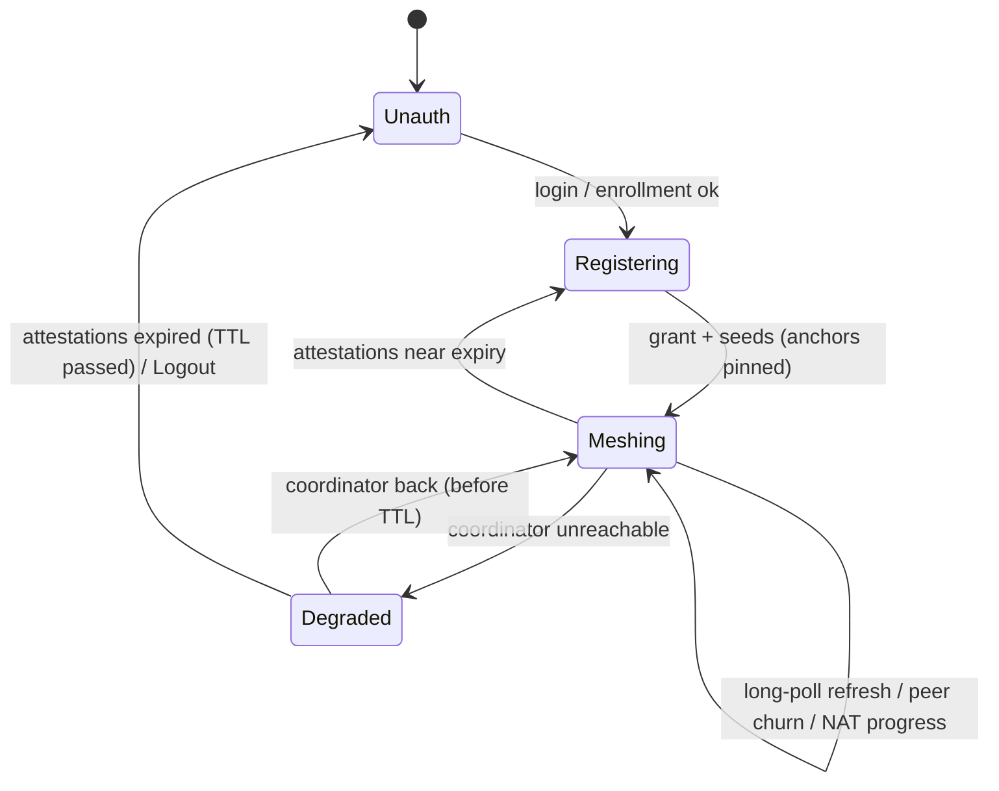

# UnityLAN — Technical Design

Implementation-level companion to [design.md](./design.md). Covers crate layout, wire formats,
APIs, and algorithms **as built**. design.md is the conceptual reference (today + vision); this
file tracks the code. When the two disagree, the code wins — flag the drift.

> **Model B** is the load-bearing fact throughout: the signed unit of membership is a **device**
> (one WG key, one IP), *not* a per-network slot. Networks (Discord roles) are **pure ACL groups**
> that gate *peering*, never addressing. Everything below follows from that.

## 1. Workspace Layout

Cargo workspace, **four crates**, two planes. The client is **two processes** (privileged engine +
unprivileged iced GUI) — the Tailscale/WireGuard-GUI split (design §3.2). All crates ship from one
monorepo tag (`common::VERSION`), so the coordinator can advertise its own version as "the release
the mesh should run".

```
unitylan/
├── Cargo.toml            # [workspace] + [workspace.dependencies]
├── crates/
│   ├── common/           # shared types, wire formats, crypto, IP math, control proto
│   │   ├── attestation.rs # the signed device-membership unit + verify
│   │   ├── api.rs         # coordinator HTTP DTOs (RegisterReq/Resp, Grant, Seed, ICE, relay…)
│   │   ├── control.rs     # engine↔GUI RPC types (ControlRequest/Response, StatusReport)
│   │   ├── wire.rs        # postcard signing envelope (`Signed`) + base64 transport
│   │   ├── crypto.rs      # ed25519 sign/verify, CoordinatorKey, enrollment-key gen
│   │   ├── netid.rs       # per-device /32 allocation math, mesh-CIDR default, label sanitize
│   │   ├── rotation.rs    # RotationCert (prev→new anchor rotation chain)
│   │   ├── relay.rs       # TURN credential (HMAC) helpers shared by engine + coordinator
│   │   ├── p2p.rs         # peer-direct refresh channel: typed UDP envelope (gossip-refresh)
│   │   └── update.rs      # signed ReleaseManifest (auto-update)
│   ├── coordinator/      # the multi-tenant bot (binary), serves 1..N guilds — control plane
│   │   ├── main.rs
│   │   ├── config.rs      # TOML: bind, db path, [fake] source / live discord+oauth, [release], cidr
│   │   ├── api.rs         # axum HTTP API + long-poll (build_snapshot, delta, wait_park, Wakers)
│   │   ├── roles.rs       # RoleSource trait: guild names + per-guild member roles
│   │   ├── discord.rs     # twilight: bot-token role/nick reads + per-guild role-name TTL cache
│   │   ├── commands.rs    # /unitylan network add|remove|list|revoke slash handler + gateway events
│   │   ├── oauth.rs       # Discord OAuth2 PKCE config + token verify (binds pubkey→user)
│   │   ├── presence.rs    # in-memory presence table + reaper (PRESENCE_TTL_SECS)
│   │   ├── signer.rs      # per-guild Ed25519 attestation signing, configurable TTL, SignCache
│   │   ├── rotate.rs      # offline `rotate-key` subcommand (mints prev→new cert)
│   │   ├── stun.rs        # STUN Binding responder (UDP; server-reflexive for ICE)
│   │   └── store.rs       # SQLite: per-guild signing keys, network registry, device allocations…
│   ├── engine/           # PRIVILEGED daemon (binary) — the data plane / mesh
│   │   ├── main.rs · service.rs · shutdown.rs   # systemd/Windows-Service/launchd lifecycle
│   │   ├── daemon.rs      # long-running mesh state machine
│   │   ├── control.rs     # local-socket server (interprocess: UDS / named pipe)
│   │   ├── coord.rs       # coordinator client: register/refresh long-poll, verify + pin anchors
│   │   ├── oauth.rs · keys.rs   # OAuth loopback PKCE; WG + token/anchor key storage
│   │   ├── wg/{mod,userspace,windows}.rs   # WgBackend: boringtun userspace · Windows wg-nt kernel
│   │   ├── fw/{mod,nftables,windows}.rs    # host firewall (default-deny on unl0)
│   │   ├── resolver/{mod,linux,windows}.rs # *.unity.internal split-DNS hookup
│   │   ├── dns.rs        # local .internal zone built from verified attestations
│   │   ├── nat.rs        # UPnP-IGD port mapping
│   │   ├── p2p.rs        # peer-direct attestation serve + pull (gossip-refresh, docs/gossip-refresh.md)
│   │   ├── ice.rs        # userspace ICE agent (webrtc-ice): STUN gather + hole-punch
│   │   ├── relay.rs      # embedded TURN server (ciphertext relay) + client
│   │   ├── ping.rs      # peer reachability probing (surge-ping)
│   │   ├── netcfg.rs · util.rs
│   │   └── selfupdate.rs # apply signed ReleaseManifest (self-replace / MSI)
│   └── gui/              # UNPRIVILEGED desktop app (binary) — iced
│       ├── main.rs       # iced app (Elm) + tray; connects to engine control socket
│       ├── ctl.rs        # control-socket client + event Subscription
│       └── tray/         # tray-icon integration
```

There is **no separate CLI crate** yet; the CLI surface is folded into the engine binary's
subcommands. **Discovery** is coordinator long-poll (§5), not gossip; `common::p2p` is the
peer-direct attestation **refresh** channel (keeping *known* peers fresh, `docs/gossip-refresh.md`) —
a distinct concern from discovering *unknown* peers, which stays on the coordinator.

## 2. Key Dependencies

Actual crates in use (workspace + per-crate). ⭐ = load-bearing.

| Concern | Crate | Notes |
|---|---|---|
| async runtime | `tokio` ⭐ | everywhere (`features = ["full"]`) |
| HTTP server (coord API) | `axum` ⭐ | client-facing long-poll API |
| HTTP client | `reqwest` ⭐ | engine → coordinator; OAuth token exchange |
| Discord bot + gateway | `twilight-{http,gateway,model,util}` ⭐ | bot-token role/nick reads; role-revocation gateway events. **GUILD_MEMBERS** privileged intent |
| signing / keys | `ed25519-dalek` ⭐ · `x25519-dalek` (via defguard) | attestations + rotation certs + release manifest; WG keys |
| WireGuard control | `defguard_wireguard_rs` ⭐ | userspace (boringtun, Linux) + Windows wg-nt kernel. Userspace path is unix-only today (§7.3) |
| NAT traversal | `webrtc-ice` · `turn` · `webrtc-util` ⭐ · `stun` (coord) · `igd-next` (UPnP) · `surge-ping` | userspace ICE agent + embedded TURN relay + STUN responder |
| GUI | `iced` ⭐ · `iced_aw` · `open` | Elm-architecture, wgpu-rendered, cross-platform. No JS toolchain |
| engine↔GUI IPC | `interprocess` ⭐ | one API over Unix sockets + Windows named pipes |
| serialization | `postcard` ⭐ (signed) · `serde_json` (API/control envelopes) | postcard = deterministic bytes → stable signatures; **never sign over JSON** |
| persistence (coord) | `sqlx` (SQLite) ⭐ | per-guild signing keys, network registry, device allocations, enrollment keys, rotation certs |
| DNS | `hickory-proto` (engine) | build/serve `.internal`; per-OS hookup in `resolver/` |
| self-update | `self-replace` · `sha2` · `semver` | verify + swap engine binary from signed manifest |
| logging | `tracing` ⭐ | all binaries |

## 3. Shared Types & Wire Formats (`common`)

### 3.1 Signing envelope (`wire.rs`)
`Signed` is **not generic** — it carries opaque postcard bytes:
```rust
struct Signed { payload: Vec<u8>, sig: Vec<u8> }   // sig = Ed25519 over payload
impl Signed {
    fn sign<T: Serialize>(key: &CoordinatorKey, value: &T) -> Result<Signed, WireError>;
    fn verify<T: DeserializeOwned>(&self, anchor: &VerifyingKey) -> Result<T, WireError>;
    fn to_base64(&self) -> String;   // transport form: base64(postcard(Signed))
}
```
Signatures are over the **postcard** bytes of the payload (deterministic). API/control envelopes
around a `Signed` are JSON, but the signed bytes inside are always postcard.

### 3.2 Attestation — the signed unit (`attestation.rs`)
**Model B: the signed unit is a device.** No `role_id`, no `nick`.
```rust
struct Attestation {
    schema:      u32,        // ATTESTATION_SCHEMA — first field; see §3.6
    guild_id:    u64,        // scoped guild; signed by THAT guild's per-guild key (§4)
    user_id:     u64,        // Discord snowflake (owner)
    username:    String,     // global @handle, sanitized DNS label  → the <user>
    device_name: String,     // per-user machine label, sanitized    → the <device>
    is_primary:  bool,       // owner's primary device gets bare <user>.unity.internal alias
    wg_ip:       Ipv4Addr,   // coordinator-allocated /32, stable, keyed by pubkey
    wg_net:      Ipv4Net,    // the deployment's mesh CIDR — signed so a MITM can't shadow the LAN
    wg_pubkey:   [u8; 32],   // Curve25519 — the device identity
    issued_at:   u64,
    expires_at:  u64,        // issued_at + ATTESTATION_TTL_SECS (30 min)
}
```
**Verification rule (MUST)** — `verify_attestation(signed, anchor, now, expected_guild)`: `schema ==
ATTESTATION_SCHEMA` (checked **first** — the other fields only mean anything if we agree on the
layout they were decoded from), **AND** signature valid under the **pinned per-guild anchor**,
**AND** `guild_id == expected_guild`, **AND** unexpired.
The `guild_id` check is load-bearing defence-in-depth even with per-guild keys (design §4.1).
Hostname = `<device>.<user>.unity.internal`; primary alias = `<user>.unity.internal`
(`is_primary` only). The `unity` label is the coordinator's namespace (fixed while
single-coordinator, `DNS_SUFFIX`); the community/guild is **not** in the name — one device is one
identity/IP across all a coordinator's guilds (Model B), so the community would be a redundant
label. It rides on each shared network (`api::SharedNetwork`) instead. The community slug still
lives at the coordinator (not in the attestation) — it tags shared networks and the CLI shows it.
`TODO(multi-coordinator)`: `unity` becomes per-coordinator (design §6.2).

### 3.3 Live endpoints (unsigned today)
There is **no `EndpointRecord`/`seq` type**. A device's endpoint rides as a plain
`Option<SocketAddr>` in `RegisterReq.endpoint` / `Seed.endpoint`, plus `ObservedEndpoint`
(`{pubkey, endpoint}`) for peer-observed reflexive addresses. Correctness is guarded by the WG
handshake (a forged endpoint fails it). design §4.2's **signed** per-member identity key for
endpoints/ICE is **planned, not built** — today only the coordinator's per-guild key signs anything.

### 3.4 Rotation cert (`rotation.rs`)
`RotationCert { prev, new }` signed by the **outgoing** guild key; the ordered chain
(`GuildAnchor.rotation_chain`, base64) lets a client whose pin is superseded walk `prev → new` and
re-pin (design §9).

### 3.5 Addressing math (`netid.rs`) — one /32 per device
```rust
const CGNAT_BASE = 100.64.0.0; const CGNAT_PREFIX = 10; const DEFAULT_PREFIX = 16;
fn default_cidr(anchor: &[u8;32]) -> Ipv4Net;              // a /16 inside 100.64.0.0/10, hash(anchor)%64
fn device_hint(net: &Ipv4Net, wg_pubkey: &[u8;32]) -> u32; // first-choice host index
fn pick_free_index(net, taken, hint) -> Option<u32>;       // probe upward, coordinator arbitrates
fn addr_from_index(net, index) -> Ipv4Addr;
fn sanitize_label(&str) -> String;                          // [a-z0-9-], ≤63, "device" fallback
```
- **Per-deployment mesh CIDR**: default `/16` derived from the deployment seed's anchor, or an
  explicit validated `cidr` in coordinator config. Disjoint blocks let a future multi-coordinator
  client avoid IP collisions. The CIDR is carried in the **signed** `Attestation::wg_net`.
- **One /32 per device**, keyed by device **pubkey** (not user, not role). Deterministic hint,
  coordinator resolves collisions. Same IP in every network the device is in. **No per-role /24s.**

### 3.6 Compatibility policy — what forces a bump, and what doesn't

The coordinator and its clients upgrade on **independent schedules**, so the wire has to tolerate
skew rather than assume a flag day. Three mechanisms, in the order you should reach for them:

1. **An additive field** — `#[serde(default)]`, no bump. Nothing in the workspace uses
   `deny_unknown_fields`, so a newer peer's extra fields are ignored by an older one. This covers
   most changes (delta sync shipped this way). Note the direction it *doesn't* cover: removing a
   field, or changing what an existing one means, is a break even though it compiles.
2. **A capability flag** — `caps: Vec<String>` on both `RegisterReq` and `RegisterResp`, from
   `common::CAPABILITIES`. Each side advertises what it implements and the other gates behavior on
   the set, so a feature needing real negotiation still ships without a bump. Unknown flags are
   simply absent from our set — never a decode error. An empty set means "infer from `proto`".
3. **A version bump** — last resort, because it costs every client in the mesh a coordinated
   upgrade. `PROTOCOL_VERSION` is the ceiling this build speaks; `MIN_PROTOCOL_VERSION` is the floor.

**Negotiation.** The client sends `[proto_min, proto]`; the coordinator picks the highest version
both speak and echoes it as `RegisterResp.proto`. Only a **non-overlapping** range is refused —
`426 Upgrade Required`, with a message naming both ranges and which side is stale. The engine treats
that as terminal rather than transient: it backs off to `PROTO_MISMATCH_BACKOFF` (5 min) instead of
`refresh_secs`, and the GUI shows it in red. `proto == 0` is a pre-versioning peer and is served
without negotiation. The same window gates the in-tunnel P2P channel, where an out-of-window peer
gets `Unsupported` and the caller falls back to the coordinator.

**Support window: current + one previous** (`MIN_PROTOCOL_VERSION == PROTOCOL_VERSION - 1`, asserted
by a test). Each bump moves the floor to the version being retired, so a client gets a full release
cycle to auto-update before a coordinator stops answering it. This is a promise that costs code:
every break needs a shim keeping the previous version working, plus a **golden fixture** in
`api.rs`'s tests — a literal JSON message as the old version sends it — that must keep decoding.
Without the fixture the floor is just a number.

**Postcard is positional.** Signed payloads (`Signed`, §3.1) are postcard, which encodes by position
and variant index, not by name — so adding, removing, or reordering a field silently changes how
every existing blob decodes, and a mismatched build can read *wrong values* rather than failing.
Two consequences:

- `Attestation` carries a leading `schema` tag, checked before anything else. Breaking it is cheap
  because `ATTESTATION_TTL_SECS` is 30 minutes: the whole signed corpus turns over on its own.
- `RotationCert` (§3.4) and `ReleaseManifest`'s enums are **frozen** — rotation chains are walked
  forever from a client's original pin, so every cert ever issued must still decode. Only append new
  enum variants; never edit those layouts in place.

**Peer failures are isolated, not fatal.** `verified_seeds` skips a seed it can't verify instead of
failing the batch, so one co-member running an unreadable build can't deny peering with everyone
else. Still fail-closed per peer — an unverified seed is never routed — and every seed failing logs
at error level, since that is the signature of a substitution attack rather than skew.

## 4. Coordinator

### 4.1 HTTP API (axum) — `api.rs::router`
Actual routes:

| Method | Path | Purpose |
|---|---|---|
| `GET`  | `/healthz` | liveness |
| `POST` | `/register` | first contact / re-register; long-poll; issues grant + seeds + anchors |
| `POST` | `/refresh` | **same handler as `/register`** — TTL renewal + presence + endpoint report |
| `POST` | `/devices/manage` | owner-scoped device ops (list/rename/set-primary/remove), token-auth |
| `GET`  | `/oauth/pkce-config` | Discord `client_id` + `fake` flag for the engine's PKCE flow |
| `POST` | `/oauth/complete` | engine hands over the access token; coordinator binds pubkey → user |

STUN is a **separate UDP responder** (`stun.rs`), not an axum route; its **port** is advertised in
`RegisterResp.stun_port` and the client pairs it with the coordinator hostname it already dials
(the coordinator can't know its own reachable address behind a container bridge or cloud NAT). There is **no `/oauth/start`, `/oauth/callback`, or `/tombstones`** — the
engine owns the OAuth loopback itself (§5.1), and revocation is presence-driven (no tombstone
endpoint built yet). Enrollment rides inside `/register` via `RegisterReq.enrollment_key`.

**Request/response** (`common::api`): `RegisterReq` carries `wg_pubkey`, `device_name`,
`enrollment_key?`, `endpoint?`, `since?` (long-poll ETag), `disabled_networks`, `observed`,
`supersede?`, `paused`, relay-capability fields, `need_relay`, `relay_allocated`, `ice`, `proto`,
`proto_min`, `caps`, `client_version`. `RegisterResp` returns `anchors` (one `GuildAnchor` per
referenced guild), `grant?` (own attestation(s) + names), `device_token?`, `seeds`, `version`,
`networks`, `stun_port?`, `proto` (the **selected** version), `proto_min`/`proto_max` (the
coordinator's own window), `caps`, `server_version`, `release?`. All version/relay/ICE fields are
`#[serde(default)]` for forward-compat with pre-versioning peers.

**A device that participates in N guilds carries N attestations** — `Grant.attestations` /
`Seed.attestations` are `Vec<GuildAttestation>`, one per guild, each signed by that guild's key.

### 4.2 Discovery — long-poll (`api.rs`)
**Not gossip.** Clients long-poll `/register`+`/refresh` carrying their last-seen `version`
(`since`). The handler:
1. `build_snapshot` — assemble the caller's grant + `seeds` (every co-member sharing ≥1 enabled
   network). Attestations come from the **`SignCache`** (`signer.rs`): an attestation binds only peer
   identity + guild (never the caller), so its blob is identical in every snapshot that includes the
   peer — signed once per reuse window and fanned out. **O(N) signs/epoch, not O(N²).**
2. **Delta sync.** The client echoes its held peers as `held: [(pubkey, rev)]` (`rev` = an opaque
   per-seed revision the coordinator minted, hashing the peer's peering-relevant content but **not**
   attestation freshness). `build_snapshot` returns only new/`rev`-changed `seeds` + a `removed` list
   (`partial = true`); empty `held` → full snapshot. Collapses a herd wake from O(N)/client to
   O(changes). Additive — a pre-delta client sends no `held` → full — so it needed no version bump.
3. If `since == current version` and the caller's own request changed nothing, park on a
   `tokio::watch` via `wait_park` for up to `longpoll_hold_secs` (≈ `attestation_ttl/2`), then return
   a fresh snapshot (renewal piggybacks the hold). A **membership** change wakes parked clients; each
   rebuild is jittered by a small per-client offset (`wake_jitter`) to flatten the fan-in.
4. **Scoped versions** (`versions.rs`). The `version` is *not* one deployment-wide counter — it's a
   hash over the caller's own `Scope`s: `Guild(g)` for each guild it holds a network role in, plus
   `User(u)` for own-device peering (which crosses guilds). A membership change bumps only the scopes
   it touched, so a change in guild A leaves every disjoint guild's clients parked instead of making
   all `T` deployed devices rebuild an O(peers) snapshot to learn nothing. This is the dominant
   control-plane cost for a coordinator hosting many small, mutually disjoint guilds. `wait_park`
   subscribes to the caller's scopes (typically 2–4 receivers); the wire type is still an opaque
   `u64`, so no protocol change. `/admin/stats` + `/metrics` keep a deployment-wide counter — the
   operator view genuinely wants every bump. Caveat: a network registered in a guild where the caller
   holds *no* other role isn't in its scope set, so it lands on the next renewal rather than
   instantly — an admin-rare event, unlike presence churn.
5. **Targeted wakeups.** Pair-specific reports (reflexive/relay/ICE — *for* one peer) don't bump any
   membership scope; they wake **only the target** via a per-pubkey `Wakers` registry. The reporter
   still returns immediately (`build_snapshot` reports `caller_changed`) to keep its report loop.
5. Presence is tracked in-memory (`presence.rs`) with a reaper at `PRESENCE_TTL_SECS`
   (`2×hold + 60s`); `paused`/`Logout`/`supersede` withdraw a device explicitly.

### 4.3 Discord integration (`roles.rs`, `discord.rs`, `commands.rs`)
- `RoleSource` trait: `TwilightRoleSource` (live bot token, GUILD_MEMBERS intent) vs
  `FakeRoleSource` (config-seeded, offline). Per-guild role-name TTL cache in `discord.rs` dedups
  the `GET guild roles` bucket across the herd.
- Slash commands `/unitylan network add|remove|list|revoke` (Manage-Guild gated); gateway events
  drive role-loss eviction. `@everyone` is rejected as a network.

### 4.4 Signing & keys (`signer.rs`, `store.rs`)
- **One independent Ed25519 key per guild** (`load_or_create_seed(guild_id)`), generated lazily on
  first use — **not** derived from a shared master. `replace_seed` + `append_rotation_cert` back the
  offline `rotate-key` subcommand (`rotate.rs`). A separate `deployment_seed` (id=1) is **not a
  signing key** — it only picks the default mesh `/16`.
- Attestation `expires_at = now + attestation_ttl_secs` (config, default 30 min = the revocation
  window); the register long-poll hold and renewal cadence derive from it (≈ TTL/2). The `SignCache`
  reuse window is `min(300s, ttl/2)` — always below the TTL, so a reused blob is never served
  expired.

### 4.5 Storage (`store.rs`, SQLite) — implemented
```
guild_signing_keys(guild_id PK, seed)          -- one independent Ed25519 seed per guild (§4.4)
deployment_seed(id=1, seed)                     -- random; selects default mesh /16 (NOT a key)
networks(guild_id, role_id, name, PK(guild,role))       -- the registry
devices(pubkey PK, idx UNIQUE, user_id, device_name, token)  -- one /32 per device
enrollment_keys(key PK, user_id, expires_at?, used_by?)      -- one-time, race-free consume
communities(guild_id PK, slug)                  -- community slug (tags shared networks; not in hostname)
primary_device(user_id PK, pubkey)              -- backs the bare <user>.unity.internal alias
oauth_authorized(pubkey PK, user_id)            -- interactive-login pubkey→user binding
guild_rotation_certs(idx PK AUTOINCREMENT, guild_id, cert)   -- prev→new chain, oldest→newest
```
Snowflakes stored as `i64` (bit-preserving; SQLite has no u64). The DB file is chmod `0600` on open
(it holds the signing seeds). Runtime `sqlx::query` (no compile-time `DATABASE_URL`). Presence +
endpoint cache are **in-memory**, lost on restart (repopulate via refresh).

## 5. Client — Engine (§5.1–5.7) + GUI (§5.8)

The privileged engine owns all mesh state and the coordinator session; the iced GUI is a thin
front-end over the engine's control socket (`common::control`, newline-delimited JSON over
`interprocess`; postcard is used only for signed payloads, `common::wire`).

### 5.1 Auth / enrollment (`oauth.rs`, `coord.rs`)
Two enrollment paths (design §3.3):
- **Interactive**: Discord OAuth2 **authorization-code + PKCE**, loopback redirect. The **engine** is
  the public client: `Control::Login` → `GET /oauth/pkce-config` (client_id + fake flag), engine
  generates PKCE verifier/challenge, binds a one-shot `127.0.0.1:<port>` listener, returns the
  authorize URL; the GUI just opens the browser. Discord redirects to the engine's loopback; the
  engine exchanges the code itself (no secret) then `POST /oauth/complete {wg_pubkey, access_token}`.
  In `fake` mode the engine skips Discord and treats the callback `code` as the token.
- **Headless**: a one-time **enrollment key** (`RegisterReq.enrollment_key`), single-use + race-free
  consume, binds the box's pubkey to its owner. No Discord client on the box.

The engine pins each guild's anchor **TOFU** on first sight, and re-pins across rotations via
`GuildAnchor.rotation_chain`.

### 5.2 WG backend (`wg/`)
```rust
trait WgBackend { ensure_iface, set_peer, remove_peer, gen_keypair, ... }
  ├── userspace.rs  // boringtun via defguard_wireguard_rs — portable primary (unix today)
  └── windows.rs    // Windows wg-nt kernel backend
```
- **One interface** (`unl0`) holds everything: the device's single `/32`; each co-device peer added
  with `AllowedIPs = <peer>/32`. Cross-network isolation is automatic — only shared-network
  co-members become peers (§6). No `native.rs` (Linux netlink deferred, design §7.3).

### 5.3 Host firewall (`fw/`)
`nftables.rs` (Linux) / `windows.rs` (PowerShell) enforce **default-deny on `unl0`** — a second gate
beyond role membership. Both sides of the platform split are tested (arg-construction unit tests).

### 5.4 Discovery client (`coord.rs`, `daemon.rs`, `p2p.rs`)
Long-poll register/refresh (§4.2); verify each `Seed`'s attestation(s) against the matching pinned
guild anchor; diff the desired peer-set against WG → `set_peer`/`remove_peer`.

**The held request must outlive the local re-check** (`pending_refresh` in `daemon.rs`). The mesh loop
re-reads local WG stats every `STATS_RECHECK` (2s) to notice a freshly-learned reflexive — one only
appears after a handshake, later than a hold would return. That re-check is **local only**: it must
*not* cancel the in-flight `/refresh`, or an idle client re-polls every 2s instead of parking for the
hold (measured: 30 req/min/client, each costing the coordinator an O(peers) snapshot build — i.e. an
O(N²)-every-2s aggregate, worse than the herd the delta/cache work removed). The request is dropped
only when it's genuinely stale: we have a reflexive/relay/ICE report, our grant needs renewing, or the
local opt-out/paused state changed — exactly the cases that also want an immediate (`since = None`)
return. Idle cost is one request per hold. **Delta merge**
(`merge_seeds`): a partial response upserts changed peers by pubkey, drops `removed`, keeps the rest
untouched; the client echoes `held: [(pubkey, rev)]` and forces a full refresh (empty `held`) when
its soonest-expiring peer attestation nears expiry (Option A).

**Peer-direct attestation refresh (`p2p.rs`, gossip — `docs/gossip-refresh.md`, default on).** The
engine serves its own coordinator-minted attestation to co-members over the WG tunnel (a small typed
UDP service on the mesh `/32`, envelope in `common::p2p`), and refreshes a held peer nearing expiry by
pulling straight from that peer (`p2p::pull`), verifying against the pinned anchor (`verify_pulled`)
exactly as the coordinator path — no new trust. A peer whose attestation lapses with **no** source
(peer offline, or revoked → can't be re-issued) is dropped on expiry, so revocation propagates via
expiry even during a coordinator outage. The coordinator stays the fallback (`held_for_refresh` →
empty → full) and the only path for bootstrap/introductions.

### 5.5 NAT traversal (`nat.rs`, `ice.rs`, `relay.rs`, `ping.rs`) — connectivity ladder
Most-direct-first (design §7.2):
- **`nat.rs`** — UPnP-IGD maps an external UDP port → local WG `listen_port`.
- **`ice.rs`** — userspace **ICE** agent (`webrtc-ice`): host + STUN server-reflexive candidate
  gathering + hole-punch. Candidates exchanged over the coordinator long-poll (`RegisterReq.ice` →
  `Seed.ice`), never run by the coordinator. STUN server = a relay co-member or the coordinator
  host at its advertised `stun_port`.
- **`relay.rs`** — embedded **TURN** server (`turn` crate) + client: a **ciphertext-only** relay for
  pairs a punch can't connect (symmetric/CGNAT/UDP-blocked). Relay eligibility is opt-in
  (`relay_capable`); the coordinator mints short-lived HMAC TURN creds (`common::relay`,
  `RELAY_CRED_TTL_SECS`) and pairs relay↔client — staying off the traffic path. `need_relay` /
  `Seed.relay` (`RelayInfo`) carry the reservation.
- **`ping.rs`** — reachability probing → `PeerReach` (`Direct`/`Punching`/`Relayed`/`Unreachable`)
  surfaced in status.

### 5.6 DNS (`dns.rs`, `resolver/`)
Build the `unity.internal` zone from verified attestations (own + co-device seeds):
`<device>.<user>` → `wg_ip`, plus the bare `<user>` primary alias. Serve via
`hickory-proto`; per-OS hookup in `resolver/{linux,windows}.rs` (resolved / NRPT+netsh). Labels are
sanitized (`sanitize_label`); **authorization is always the pubkey in the signed attestation**, never
the name.

### 5.7 Daemon state machine (`daemon.rs`)


### 5.8 GUI (`gui/`, iced) — unprivileged front-end
All-Rust Elm architecture; talks **only** to the engine. `ctl.rs` = control-socket client + a
`Subscription` streaming `ControlResponse`/`StatusReport` events into `Message`s. `tray/` = tray-icon
(up/down, quick toggles, open/quit); the engine keeps the mesh up when the window closes. Every
privileged action is a `ControlRequest` RPC — the GUI needs no elevation. `ControlRequest` covers
`Status`, `Manage`, `Expose`, `SetNetwork`, `Login`, `SetConnected`, `SetNewNetworkDefault`,
`Logout`, `BlockPeer`/`UnblockPeer` (local, user-keyed), `ApplyUpdate`.

## 6. Peering = ACL (Model B)

"Enforce role membership" = **only current role-holders' pubkeys appear in the peer-set**. A client
adds a co-device as a WG `[Peer]` (`AllowedIPs = <device>/32`) iff it holds a valid, unexpired,
guild-matched attestation for it in a **shared enabled network**. Non-shared devices → no peer → no
route → dropped (plus the default-deny firewall, §5.3). A device in two networks reaches members of
both; those two groups can't reach each other except through a shared member — Tailscale ACL/tag
semantics. Local `disabled_networks` / block-peer let the client narrow this further, client-side.

## 7. Security Notes

- Coordinator holds **no traffic, no WG private keys**. Compromise of a guild key → forge
  memberships **for that guild only** (per-guild keys bound the blast radius); never decrypt
  traffic. DB is `0600`; signing seeds live in it. End-state: encrypted at rest (design §9).
- Trust anchor **pinned per guild TOFU**; rotation via signed `prev → new` chain
  (`rotation.rs`, `rotate-key`). Compromise ≠ loss → recovery is **out-of-band re-pin**; the pinned
  fingerprint is surfaced in GUI/CLI for OOB verification.
- Attestation is **pubkey-bound** → replay within TTL gains nothing without the WG private key
  (never leaves the device). Re-key uses `supersede`; a presence reaper backstops unclean drops.
- Relay sees **ciphertext only** (e2e intact) but learns traffic metadata + can drop/delay → relay
  is **opt-in** and being-relayed is surfaced. ICE-candidate signing (design §4.2/§7.2) is the
  planned hardening against candidate injection — **not built yet**.
- Client secrets (WG privkey, OAuth token, pinned anchors) stored under OS protection / `0600`.
- Register/enroll/refresh is auth-gated; enrollment keys are ≥128-bit, short-expiry, single-use.

## 8. Open Technical Questions / Gaps vs design.md

Built and settled: per-guild keys + `guild_id`-match MUST; long-poll discovery; ICE + TURN relay +
STUN; anchor rotation chain; auto-update signed manifest; Model-B device addressing with signed
`wg_net`.

Still open / planned (design.md ahead of code):
- **Signed endpoints + ICE candidates** — the per-member identity key (design §4.2) is unbuilt;
  endpoints/candidates ride unsigned today (WG handshake guards correctness; rate-limit guards
  volume). This is the main remaining integrity gap.
- **In-mesh (peer-to-peer) endpoint propagation** — today all endpoint churn rides the coordinator
  refresh; the sponsor-gossip / established-tunnel path (design §4.2/§5) is unbuilt.
- **Tombstones** — no revocation endpoint yet; revocation is TTL + presence eviction only.
- **Userspace Windows backend** (boringtun + Wintun) — Windows runs the wg-nt **kernel** backend;
  userspace-Windows (prereq for magicsock-on-Windows and one-data-plane) is a future item (§7.3).
- **Linux netlink native backend** — deferred (optional perf; userspace is primary).
- **Userspace throughput (GSO/GRO)** — boringtun is strictly per-packet; wireguard-go's Linux
  UDP-GSO/TUN-TSO batching (~2.2× bulk) is absent. Invisible below ~2 Gbit/s for mesh traffic;
  deferred, track boringtun upstream.
- **Per-network PSK**, **encrypted-at-rest signing key**, **tailnet-lock co-signature** — all
  deferred (design §9).
