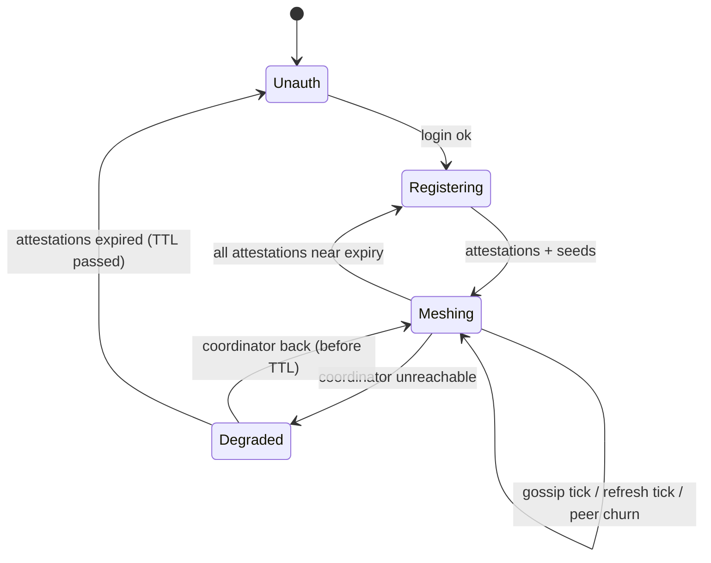

# UnityLAN — Technical Design

Implementation-level companion to [design.md](./design.md). Covers crate layout, wire
formats, APIs, and algorithms. Library picks marked ⭐ are recommended defaults; ⚠️ marks
choices worth confirming before M1.

## 1. Workspace Layout

Cargo workspace. The **client is two processes** (privileged engine + unprivileged iced
GUI) — the Tailscale/WireGuard-GUI split (design §3.2). Five crates:

```
unitylan/
├── Cargo.toml            # [workspace]
├── crates/
│   ├── common/           # shared types, wire formats, crypto, IP math, control proto
│   │   ├── attestation.rs
│   │   ├── wire.rs       # postcard (de)serialization + signing envelope
│   │   ├── crypto.rs     # ed25519 sign/verify, key types
│   │   ├── netid.rs      # subnet-from-hash, IP allocation math, name sanitize
│   │   ├── api.rs        # coordinator HTTP + gossip DTOs
│   │   └── control.rs    # engine↔GUI RPC types (requests, events)
│   ├── coordinator/      # the multi-tenant bot (binary), serves 1..N guilds
│   │   ├── main.rs
│   │   ├── config.rs     # TOML: bind, db path, [fake] source (M1), live discord/oauth (later)
│   │   ├── roles.rs      # RoleSource trait: guild names + per-guild member roles (fake now)
│   │   ├── discord.rs    # twilight: bot-token role/nick reads + gateway events (later)
│   │   ├── commands.rs   # /unitylan network add|remove|list slash handler (later)
│   │   ├── oauth.rs      # Discord OAuth2 (identify) for client auth (later)
│   │   ├── api.rs        # axum HTTP API for clients (/register)
│   │   ├── signer.rs     # ed25519 attestation signing, TTL
│   │   └── store.rs      # SQLite: signing key, network registry, allocations
│   ├── engine/           # PRIVILEGED daemon (binary) — the mesh
│   │   ├── main.rs       # runs as systemd / Windows Service / launchd
│   │   ├── daemon.rs     # long-running mesh state machine
│   │   ├── control.rs    # local-socket server (interprocess: UDS / named pipe)
│   │   ├── auth.rs       # OAuth loopback flow, token/key storage
│   │   ├── coord.rs      # coordinator client (register/refresh, verify attestations)
│   │   ├── wg/           # WgBackend trait + defguard impls
│   │   │   ├── mod.rs
│   │   │   ├── native.rs     # kernel/netlink (Linux) · WireGuardNT (Windows)
│   │   │   └── userspace.rs  # boringtun/wireguard-go (portable primary)
│   │   ├── gossip.rs     # anti-entropy over the mesh (axum on wg_ip)
│   │   ├── nat.rs        # UPnP mapping + hole-punch coordination
│   │   └── dns.rs        # local *.internal resolver (per-OS integration)
│   └── gui/              # UNPRIVILEGED desktop app (binary) — iced
│       ├── main.rs       # iced app + tray-icon; connects to engine control socket
│       ├── app.rs        # State / Message / update / view (Elm architecture)
│       ├── screens/      # networks, peers, settings views
│       └── engine.rs     # control-socket client + Subscription of engine events
```

An optional thin CLI can be added later as a third front-end on the same control socket;
not in v1.

## 2. Key Dependencies

| Concern | Crate | Notes |
|---|---|---|
| async runtime | `tokio` ⭐ | everywhere |
| Discord bot + gateway | `twilight-{http,gateway,model}` ⭐ | lean, selective intents; need **GUILD_MEMBERS** privileged intent for role/nick + member-update events |
| Discord OAuth2 | `oauth2` + `reqwest` ⭐ | `identify` scope only; coordinator maps `user_id → roles` via bot token |
| HTTP server (coord API) | `axum` ⭐ | client-facing API |
| HTTP client | `reqwest` ⭐ | client → coordinator; peer → peer gossip |
| signing | `ed25519-dalek` ⭐ | attestations + tombstones |
| WG keys | `x25519-dalek` ⭐ | generate/parse Curve25519 WG keys |
| WireGuard control | `defguard_wireguard_rs` ⚠️ | one crate over **userspace (portable primary)** + **native** (Linux netlink, Windows WireGuardNT). ⚠️ verify Win/Mac paths in M2 spike |
| GUI | `iced` ⭐ | Elm-architecture, all-Rust, wgpu-rendered, cross-platform. No JS toolchain |
| system tray | `tray-icon` ⭐ | iced has no built-in tray; VPN app lives in the tray |
| engine↔GUI IPC | `interprocess` ⭐ | one API over **Unix sockets + Windows named pipes** |
| engine as a service | systemd unit · `windows-service` · launchd plist | per-OS install of the privileged engine |
| serialization | `postcard` ⭐ (signed) / `serde_json` (API envelopes) | postcard = deterministic bytes → stable signatures. JSON not canonical → never sign over it |
| persistence (coord) | `sqlx` (SQLite) ⚠️ | allocations, signing key, tombstones. Alt: `sled` / JSON file |
| UPnP | `igd-next` ⭐ | open WG listen port |
| local DNS | `hickory-server` ⚠️ | serve `.internal`. Per-OS hookup: resolved/resolv.conf (Linux) · NRPT/netsh (Windows) · resolver dir (macOS). MVP fallback: hosts file |
| logging | `tracing` ⭐ | all binaries |

## 3. Shared Types & Wire Formats (`common`)

### 3.1 Attestation (the signed unit)
```rust
// serialized with postcard → canonical bytes → signed
struct Attestation {
    guild_id: u64,
    role_id:  u64,          // = network id
    user_id:  u64,
    nick:     String,       // sanitized DNS label, unique within network
    wg_ip:    Ipv4Addr,     // coordinator-allocated /32 in the role subnet
    wg_pubkey:[u8; 32],     // Curve25519
    issued_at: u64,         // unix secs
    expires_at:u64,         // issued_at + 1800
}

struct Signed<T> {          // transport envelope
    payload: Vec<u8>,       // postcard(T)
    sig:     [u8; 64],      // ed25519 over payload, by coordinator key
}
// on the wire: base64(postcard(Signed<Attestation>))
```
Verify: `ed25519 verify(coord_pubkey, payload, sig)` **and** `now < expires_at`. Then
`postcard::from_bytes::<Attestation>(payload)`.

### 3.2 Endpoint record (unsigned, gossiped)
```rust
struct EndpointRecord { wg_pubkey: [u8;32], endpoint: SocketAddr, seq: u64 }
```
Newest `seq` wins. Correctness guarded by WG handshake (see design §4.2). `seq` = client's
monotonic counter (persisted) so a restart doesn't regress.

### 3.3 Tombstone (signed revocation)
```rust
struct Tombstone { guild_id:u64, role_id:u64, user_id:u64, revoked_at:u64 }
// transported as Signed<Tombstone>; supersedes any attestation for that (user,role)
```

### 3.4 Subnet & IP math (`netid.rs`)
```rust
// network subnet: /24 inside 100.64.0.0/10
fn subnet_of(guild_id:u64, role_id:u64) -> Ipv4Net {   // 100.64.0.0/10 has 2^14 /24s
    let h = siphash(guild_id, role_id) % (1<<14);       // 14 bits of /24 index
    // 100.64.0.0/10 → vary the low 14 bits above the /10 prefix
    ipv4_from_index(0x6440_0000, 10, h)                 // → 100.64.x.0/24
}
// host: coordinator allocates .2..=.254 (.1 reserved for... nothing; no gateway in mesh)
fn host_hint(user_id:u64) -> u8 { (siphash(user_id) % 253) as u8 + 2 }
```
`.1` reserved (future gateway/router); collisions resolved by coordinator's persistent map.

## 4. Coordinator

### 4.1 HTTP API (axum, HTTPS) — client-facing
| Method | Path | Body → Resp | Purpose |
|---|---|---|---|
| `GET` | `/oauth/start` | → redirect | begin Discord OAuth (loopback redirect) |
| `GET` | `/oauth/callback` | code → session token | finish OAuth; coordinator learns `user_id` |
| `POST`| `/register` | `{wg_pubkey}` → `{coord_pubkey, grants[]}` | issue a grant per registered network the caller holds, **across all guilds** the caller shares with the bot; pin key |
| `POST`| `/refresh` | `{wg_pubkey, endpoint?}` → `{grants[], seeds, tombstones_since}` | TTL refresh + report endpoint (source addr also observed = STUN) |
| `GET` | `/tombstones?since=` | → `[Signed<Tombstone>]` | revocations |

`Grant = { attestation: base64(Signed<Attestation>), guild_name, network_name }` — the names
build `<nick>.<network>.<guild>.internal`. `SeedRecord` (added at M3) =
`{ attestation, endpoint_hint: Option<SocketAddr> }`. Session auth: bearer token from OAuth
callback; short-lived, tied to `user_id`. (M1 offline: `?dev_user=` query stands in for the
session.)

### 4.2 Discord integration (`discord.rs`)
- **Bot token**, `GUILD_MEMBERS` intent.
- On `/register`/`/refresh`: fetch member → roles + nick (REST, cached).
- **Gateway** `GUILD_MEMBER_UPDATE` / `GUILD_MEMBER_REMOVE` → on role loss, write a
  `Tombstone` and stop re-signing that `(user,role)`. This is what makes revocation prompt.

### 4.3 Signing & TTL (`signer.rs`)
- Ed25519 keypair generated on first run, persisted (0600, or OS keystore). Public half =
  the guild's trust anchor, returned in `/register`.
- Attestation `expires_at = now + 1800`. Clients refresh at ~half-life (900 s).

### 4.4 Storage (`store.rs`, SQLite) — implemented
```
signing_key(id=1, seed BLOB)                             -- single row
networks(guild_id, role_id, name, PRIMARY KEY(guild,role))  -- the registry
allocations(guild_id, role_id, user_id, host, PRIMARY KEY(guild,role,user))  -- host octet
tombstones(guild_id, role_id, user_id, revoked_at, sig)  -- added at M7
```
Snowflakes stored as `i64` (bit-preserving cast; SQLite has no u64). `host` = the `.2..=.254`
octet; the address is `host_addr(subnet_of(guild,role), host)`. Uses runtime `sqlx::query`
(no compile-time `DATABASE_URL` needed). Endpoint cache = in-memory (added at M3), lost on
restart (seeds repopulate via `/refresh`).

## 5. Client — Engine (§5.1–5.6) + GUI (§5.7)

The engine (privileged daemon) owns all mesh state and the coordinator session. The iced GUI
is a thin front-end over the engine's control socket. They talk via `interprocess`
(UDS/named pipe) using `common::control` RPC types.

### 5.1 Auth flow (`engine/oauth.rs`, GUI/CLI-triggered)
Discord OAuth2 **authorization-code + PKCE**, loopback redirect. The **engine** is the public
client (it owns the session and calls `/register`); the coordinator holds no secret and only
verifies the resulting token. The **GUI** just opens the browser.
1. `Control::Login` (GUI button / `login` CLI) → engine `GET /oauth/pkce-config` (Discord
   `client_id` + fake-mode flag), generates the PKCE `verifier`/`challenge`, binds a one-shot
   `127.0.0.1:<port>` listener (the fixed `oauth_redirect`), and returns the authorize URL.
2. The URL is opened; Discord redirects **straight to the engine's loopback** with `code`+`state`.
   The engine exchanges the code at Discord's token endpoint (PKCE `code_verifier`, **no secret**)
   for an access token, then `POST /oauth/complete {wg_pubkey, access_token}`.
3. The coordinator verifies the token (`GET /users/@me`) and binds pubkey → user. The engine's
   register loop picks up the binding and brings up the mesh.

The loopback redirect is fixed and registered once with the Discord app (which needs the
`PUBLIC_OAUTH2_CLIENT` flag), so login works from any host/VM regardless of LAN address — no
reachable coordinator URL required. (Discord has no device-code grant → loopback is the
desktop-friendly path.)

### 5.2 WG backend (`wg/`)
```rust
trait WgBackend {
    fn ensure_iface(&self, addrs: &[Ipv4Net], listen_port: u16) -> Result<()>;
    fn set_peer(&self, pubkey: [u8;32], allowed: Ipv4Net, endpoint: Option<SocketAddr>) -> Result<()>;
    fn remove_peer(&self, pubkey: [u8;32]) -> Result<()>;
    fn gen_keypair() -> (StaticSecret, PublicKey);
}
```
- **One interface** (`unl0`) holds all networks: `addrs` = the client's per-role `/32`s;
  each peer added with `AllowedIPs = <peer_wg_ip>/32`. Cross-network isolation is automatic
  (only shared-network peers get routes; no forwarding).
- `native.rs` / `userspace.rs` both via `defguard_wireguard_rs`. **Userspace is the portable
  primary** (Linux/Win/Mac); select **native** where present (Linux netlink, Windows
  WireGuardNT) as an optimization. macOS = userspace only.

### 5.3 Gossip (`gossip.rs`) — anti-entropy over the mesh ⭐
Pull-based over WG (member-only, already encrypted). Each client runs a tiny HTTP endpoint on
its `wg_ip`:
```
GET http://<peer_wg_ip>:<gport>/state
  → { attestations: [Signed<Attestation>], endpoints: [EndpointRecord], tombstones: [Signed<Tombstone>] }
```
Loop: every ~10 s pick a few random current peers, `GET /state`, merge:
- attestations: verify sig+TTL, keep unexpired; a matching tombstone drops the pubkey.
- endpoints: keep highest `seq` per pubkey.
- reconcile → compute desired peer-set → diff against WG → `set_peer`/`remove_peer`.
State lives only in RAM; the coordinator + gossip repopulate on restart.

### 5.4 NAT (`nat.rs`)
- **UPnP** (`igd-next`): map an external UDP port → local WG `listen_port`; publish the
  mapped `ip:port` as the endpoint.
- **Hole punch**: for a peer whose direct dial fails, ask a mutually-connected peer (over the
  mesh) to relay the other's live endpoint + a synchronized punch signal; both send
  simultaneously to open NAT mappings, then WG handshakes.

### 5.5 DNS (`dns.rs`)
- Build the `.internal` zone from verified attestations: `<nick>.<role_name>.<guild_name>` →
  `wg_ip`. (Role/guild *names* fetched once from the coordinator; ids used internally.)
- Serve via `hickory-server` on `127.0.0.53:53` (or a chosen loopback), routed for
  `.internal` through `systemd-resolved`/`resolv.conf`. ⚠️ MVP fallback: rewrite `/etc/hosts`.

### 5.6 Daemon state machine (`daemon.rs`)


### 5.7 GUI (`gui/`, iced) — unprivileged front-end
All-Rust, Elm architecture. No web, no JS toolchain. Talks only to the engine (never to the
coordinator or peers directly).
```rust
struct App { conn: EngineConn, networks: Vec<NetView>, status: EngineStatus }  // State
enum Message {                                                                 // Message
    Login, ToggleNet(RoleId), Expose { port: u16, role: RoleId },
    EngineEvent(control::Event),        // pushed from the engine over the socket
}
// update(): map UI actions → control::Request sent to the engine
// view():   render networks / peers / status from State
// Subscription: stream control::Event from the engine socket → EngineEvent
```
- **Control transport**: `interprocess` local socket to the engine; `common::control`
  request/event enums, postcard-framed. A `Subscription` turns the event stream into
  `Message`s (live status/peer updates).
- **Tray** (`tray-icon`): show up/down, quick toggles, "open"/"quit"; the engine keeps the
  mesh running when the window is closed.
- **No privilege**: every privileged action (WG, DNS, ports) is an RPC to the engine; the GUI
  itself needs no elevation.

## 6. Security Notes
- Coordinator holds no traffic, no WG private keys. Compromise → forge memberships for that
  guild (not decrypt traffic). Protect the Ed25519 signing key (0600 / OS keystore).
- Trust anchor pinned on first `/register`; ⚠️ rotation story is an open design item.
- Gossip endpoint on `wg_ip` is reachable only by mesh members (WG-gated) — but still
  validate/authorize inputs (a malicious member could feed junk; sig-checks + rate limits).
- Client stores session token + WG privkey 0600.

## 7. Open Technical Questions
- **`defguard_wireguard_rs` vs split (`wireguard-control` + `boringtun`)** — validate the
  former genuinely covers both kernel + userspace on target distros (⚠️ M2 spike).
- **DNS integration** — `hickory-server` + resolved split-DNS vs `/etc/hosts` for MVP.
- **Gossip over HTTP-on-wg_ip vs a compact UDP anti-entropy** (SWIM-style) — HTTP is simplest
  to build/debug; revisit if churn/scale demands it.
- **Coordinator persistence** — SQLite vs sled vs flat file (scale is tiny; SQLite chosen for
  durability + simple queries).
- **Signing-key custody** — file (0600) vs OS keystore vs age-encrypted at rest.
- **Clock skew** — TTL/`issued_at` assume roughly synced clocks; how much skew to tolerate.
- **Userspace backend throughput (GSO/GRO)** — the userspace primary (boringtun, via
  `defguard_boringtun`) is strictly per-packet: one `send_to`/`recv_from` per datagram, `Tunn`
  encap/decap per packet, no `vnet_hdr` on the TUN. wireguard-go gained Linux UDP GSO/GRO +
  TUN-side TSO/GRO + vectorized `sendmmsg`/`recvmmsg` (wireguard-go PR #75, 2023) for ~2.2x bulk
  throughput; boringtun has none of it. Adding it = forking `defguard_boringtun` (not this repo):
  UDP GSO/GRO alone is a partial win (drops syscall overhead only — crypto stays per-packet),
  and the big TUN-side TSO win needs a batched vector API through boringtun's noise core.
  Invisible below ~2 Gbit/s for typical mesh traffic. Defer: accept the gap, track boringtun
  upstream; revisit only if a workload gates on Linux bulk throughput.

## 8. M1 Cut (what to build first)
Smallest vertical slice proving the trust model:
1. `common`: `Attestation`, `Signed<T>`, postcard wire, ed25519 sign/verify, `netid` math.
2. `coordinator`: OAuth (`identify`) → `user_id`; bot-token role/nick read; `/register`
   issuing a `Signed<Attestation>`; SQLite allocation.
3. `engine` (headless, **no GUI yet**): OAuth loopback; gen WG keypair; `POST /register`;
   **verify** the attestation + pin coord pubkey. Print the resulting `wg_ip` + hostname.

No WG, gossip, NAT, DNS, or iced GUI yet — just prove *authenticated, signed, role-derived
membership* end to end. GUI lands once the engine + control socket exist (later milestone).
